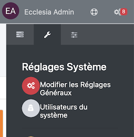
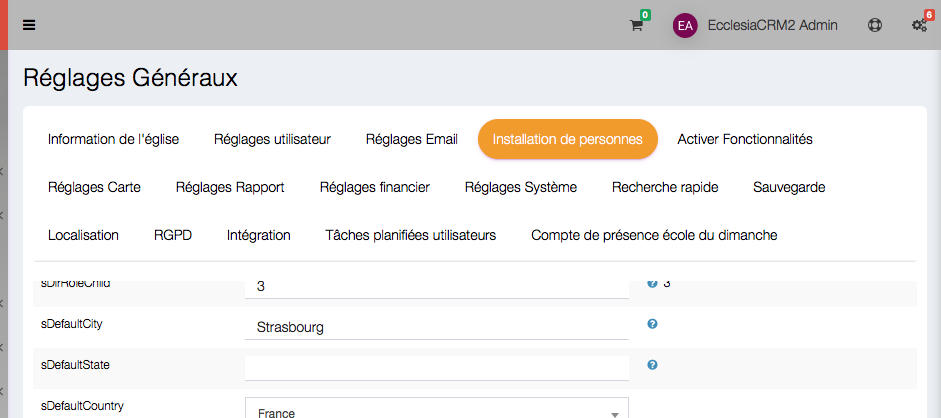
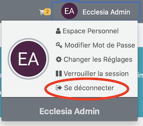
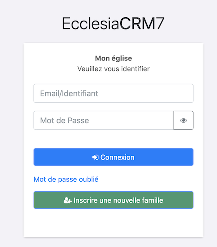
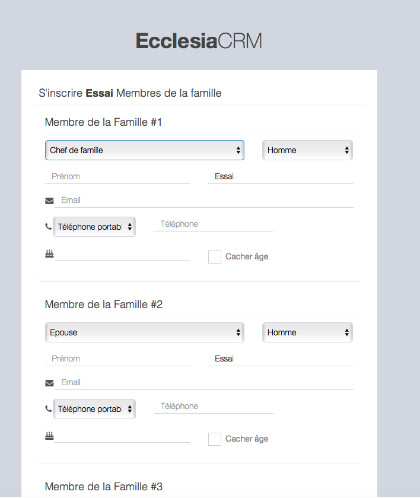
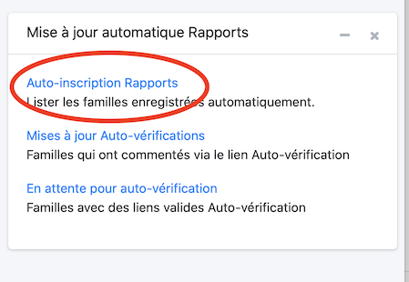

Vous pouvez demander aux familles de s'inscrire ainsi que ses membres.

# Activer l'auto-inscription

Pour cela aller dans les réglages

Puis aller dans la partie Installation de personnes

Il faut activer la fonctionnalité : "bEnableSelfRegistration"

En faisant passer l'option à "Vrai"

On valide en bas de page

Puis on peut quitter sa session, pour voir le résultat

# Inscription de Familles

En allant sur le CRM, la fenêtre de login sera

Il est possible d'utiliser "Inscrire une nouvelle famille"

Vous saisissez le nom de famille, et toutes les données nécessaires, en précisant le nombre d'enfants

En validant, vous devrez valider chaque membres (conjoint(e) et enfants) 

Votre famille sera maintenant inscrite

# Visualiser les nouveaux inscrits en tant qu'administrateur

Aller dans 

Puis sélectionner

Vous aurez l'ensemble des familles qui se sont auto-inscrites

On peut cliquer sur l'ID de la famille pour la visualiser, ou la supprimer.

> Note : il est donc possible de visualiser, précisément chaque famille et surtout de d'activer ou de désactiver la fonctionnalité en fonction des périodes d'inscription des familles et des membres.

