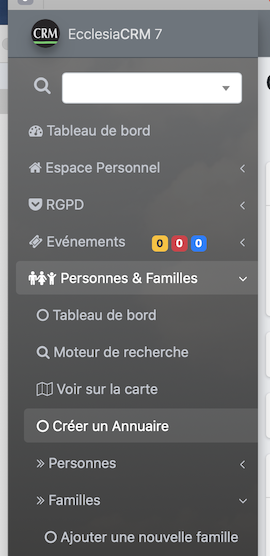

# 
<big>Créer une famille & Ecclesia**CRM** </big>

##Pour créer une famille

rien de plus simple, aller dans le menu "Personnes & Familles", "Familles", "Ajouter une Famille".

##Informations

C'est à cette endroit que vous pourrez saisir, la date de mariage, les enfants, leur rôle dans la famille ...

Si vous avez saisi des champs personnalisables, c'est également à cette endroit que vous pourrez les saisir.

