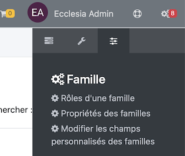
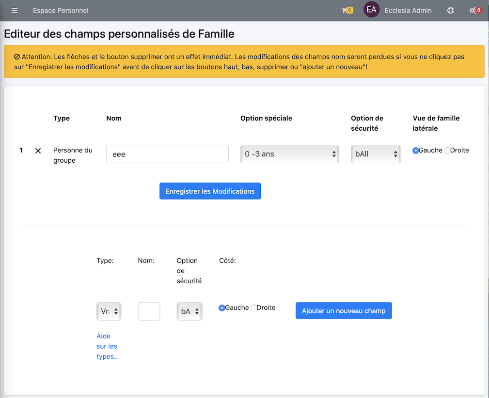

# 
<big>Gestion des Champs personnalisables de famille & Ecclesia**CRM** </big>

##Aller dans les réglages de personnalisation

Il suffit de choisir l'item de menu : " Modifier les champs personnalisées des familles"

##Pour Ajouter un nouveau champ personnalisable

Cliquer sur "Ajouter une nouvelle Propriété"

Les champs personnalisables sont de type :

- Boolean :
- Date    :
- Du texte de type 50 ou 100 ou infini en terme de caractères :
- Année   :
- Saison  :
- Nombre  :
- Personne du groupe :
- Argent  :
- Numéro de téléphone :
- Liste personnalisable déroulante :

Il est possible de

- les positionner à gauche ou à droite
- de fixer les droits par rôle : bAll etc ...
