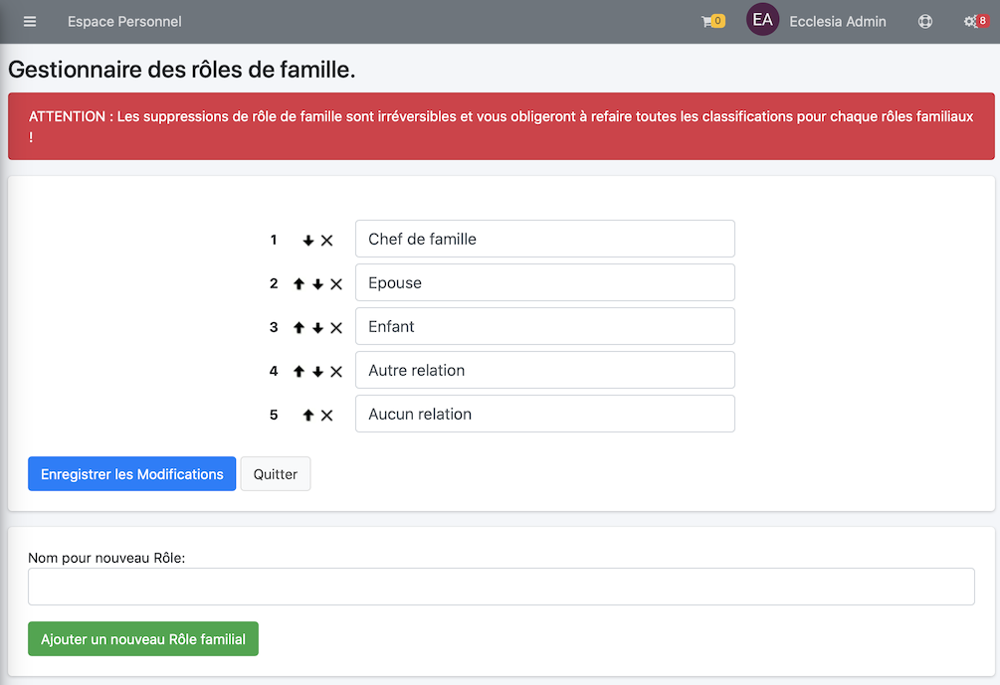

# 
<big>Gestion des rôles famille & Ecclesia**CRM** </big>

##Aller dans les réglages de personnalisation

Il suffit de choisir l'item de menu : "Rôles d'une famille"

##Réglages par défaut

Quand Ecclesia**CRM** est installé pour la première fois, des rôles par défaut sont installés. C'est les rôles ci-dessous.

##Ajouter Modifier des rôles.

Tout est assez clair dans cette vue

- Il est possible de classer les rôles avec les flèches vers le haut ou le bas
- de supprimer un rôle avec la croix
- de créer un rôle via la partie en bas
