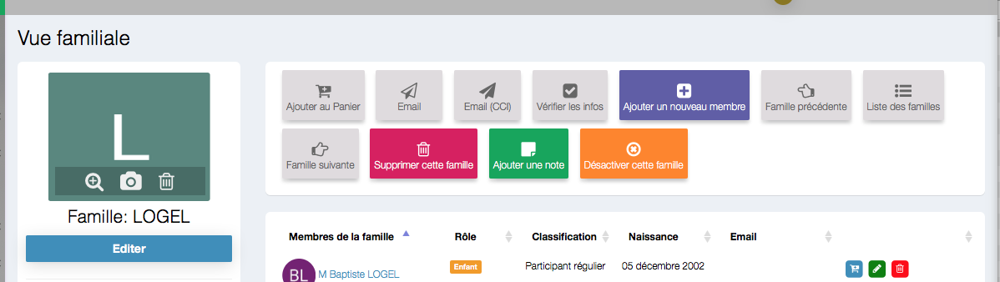

# 
<big>Supprimer désactiver une famille & Ecclesia**CRM** </big>

##Pour supprimer une famille

Vous recherchez une famille via le lien de recherche dans le menu de gauche.

Vous obtiendrez la vue suivante avec ses boutons

La suppression d'une famille peut avoir des impacts au niveau légal

- dans le cas de dépôt fait par la famille
- de note prise par la famille

##Désactiver une famille

Désactiver une famille, placera la famille dans les familles désactivées et ne fera plus partie d'aucune recherche possible dans le cas du RGPD.

Au bout de deux années, la famille passera dans la gestion RGPD et sera administrable via le DPO gérant la partie RGPD.

##RGPD : ATTENTION

**Attention** une famille inactive ne doit pas être réactivée comme cela, sa date de désactivation sera alors fausse. Cela peut engendrer des poursuites judiciares, en raison du RGPD.
