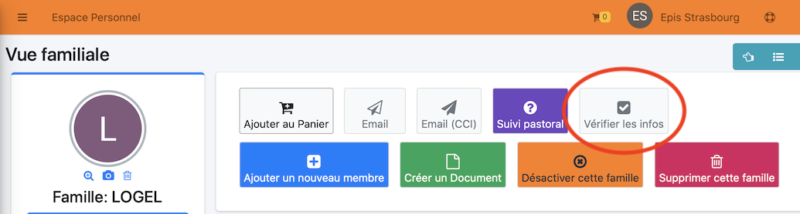
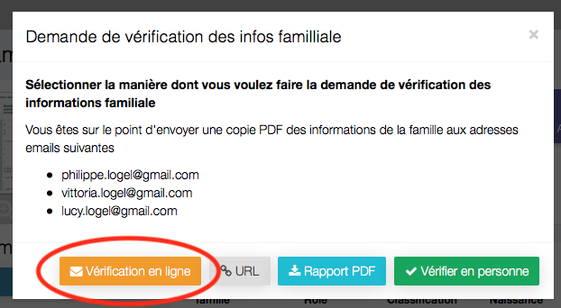
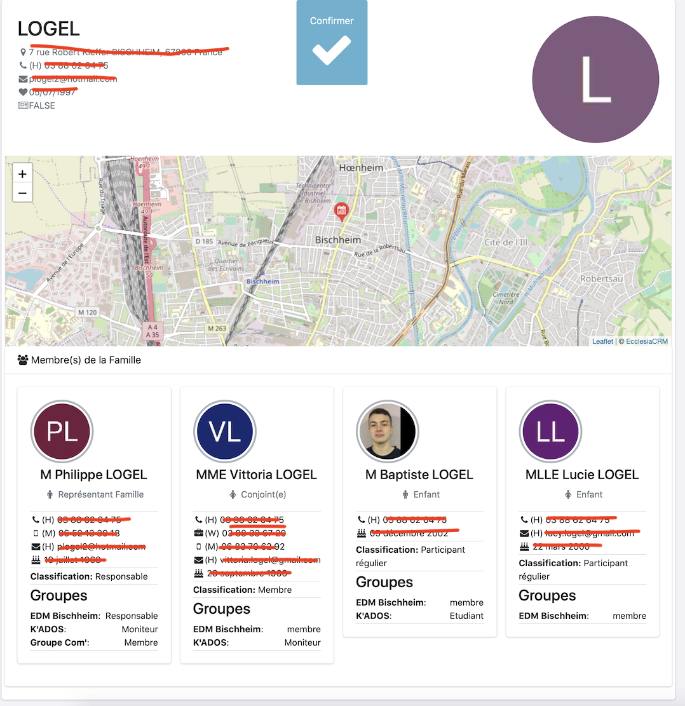
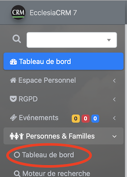
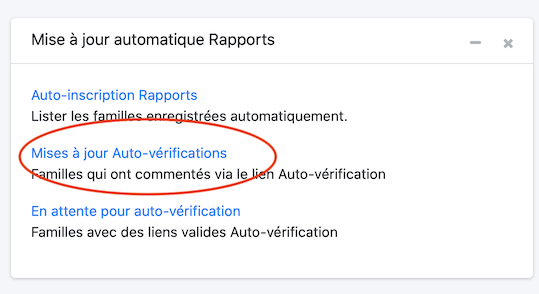

Vous pouvez demander aux familles de valider les données que vous avez saisies

# Pour envoyer une auto-vérification

Pour cela chercher une famille via le menu rechercher, on tombera sur la vue suivante. Il suffira ensuite de cliquer le bouton : "Vérifier les Infos"

On obtient

Un mail sera envoyé à chacun des membres de la famille sous la forme

# Réponse pour les utilisateurs

Ils peuvent rajouter un commentaire

# Administrateur

Pour voir les réponses des utilisateurs, aller dans 

Puis sélectionner

On obtient alors les résultats

Avec les commentaires.

 

