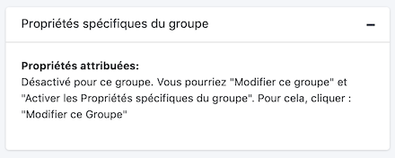
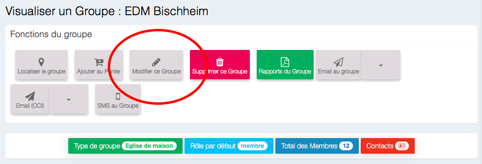
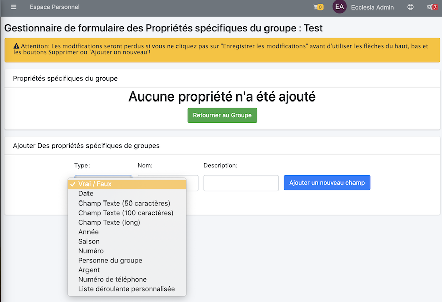
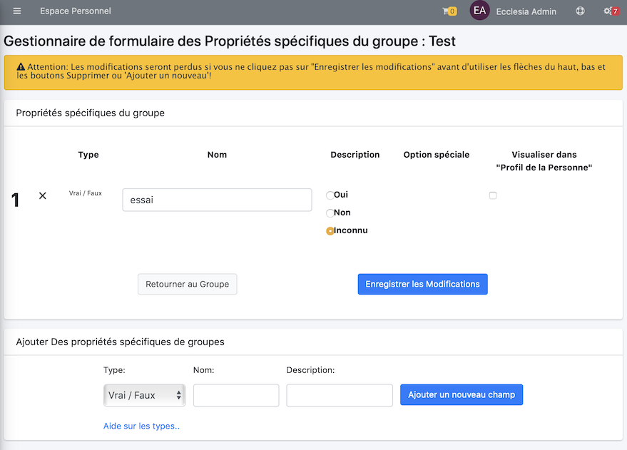

# 
<big>Propriétés globales & Ecclesia**CRM** </big>

Dans EcclesiaCRM, il y a de deux types de propriétés

##Les propriétés spécifiques

Elles sont fixés pour un seul groupe ...

Pour accéder à ces propriétés, on sélectionne un groupe, via le menu rechercher

On doit activer les propriétés spécifiques de groupes

Pour cela on clique

Il suffit de cliquer

On peut maintenant ajouter les propriétés spécifiques aux groupes

##Affecter des propriétés spécifiques à un groupe

On sélectionne un groupe, via le menu rechercher

On peut maintenant les éditer

Il suffit maintenant de rajouter les propriétés comme suit

Voici un exemple

##Astuce

En cliquant la case à cocher "Prfile de la personne", on peut donner aux personnes la possibilité de modifier chacune pour elle même la valeur de ce champ.

**En faisant cela, on obtient par exemple une forme de Sondage de type Doodle personnalisé.**

Au final, voici le résultat en cliquan "Retourner au Groupe" :

