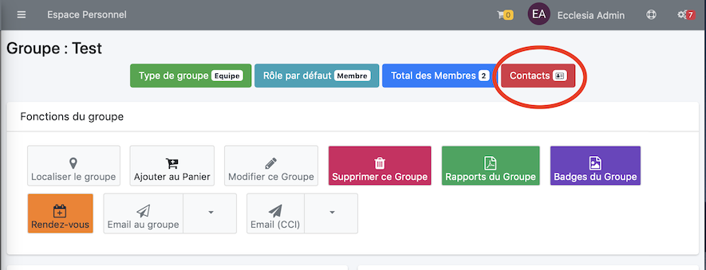

# 
<big>Exporter contacts CardDav& Ecclesia**CRM** </big>

Pour cela vous sélectionnez le groupe et vous cliquez le bouton suivant

Le fichier exporté pourra être intégré ensuite au carnet d'adresses ou à thunderBird.