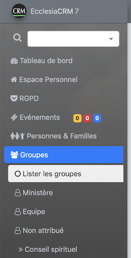
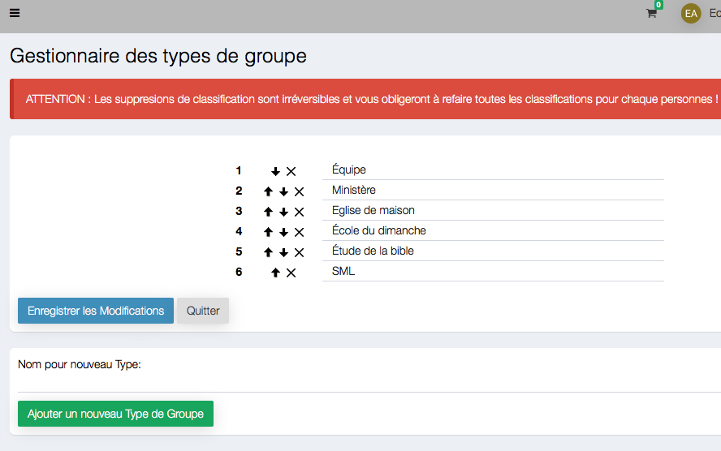
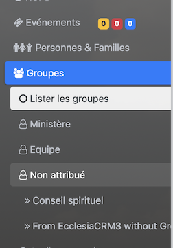
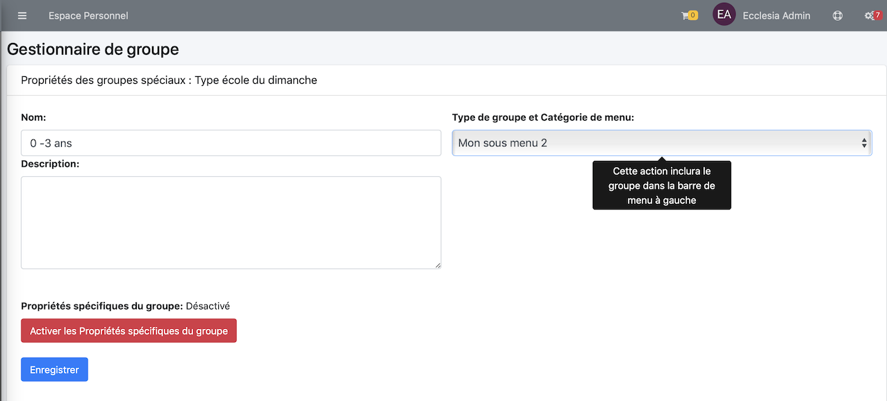

# 
<big>Groupe & Menu & Type dans Ecclesia**CRM** </big>

Le type de groupe permet de classer les groupes par catégories, dans un contener si on veut.

Il permet également de faire la classifications des groupes dans le menu de la barre latérale gauche.

##Ajouter un nouveau groupe

On consulte l'ensemble de ces groupes

On ajoute

- le nom du groupe, par exemple essai
- puis on fait ajouter

Voici le résultat

Il est classé pour l'instant dans les groupes non assignés

##Type de groupe & Classer ce groupe dans la barre latérale (Menu)

Pour créer un nouveau type de groupe

On peut ici créer un type de groupe

Nous pouvons ensuite la propriété à ce groupe, sélectionner le groupe

Il suffit maintenant de cliquer le bouton

Puis de choisir le type

Voici le résultat

**Remarque**
- Le groupe école du dimanche est un groupe spécial que nous aborderons dans une autre partie.
- Tous les types de groupe sont complètement personnalisables.
