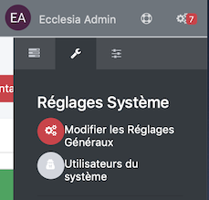
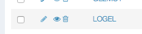
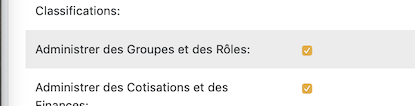
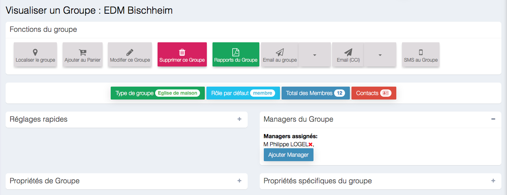
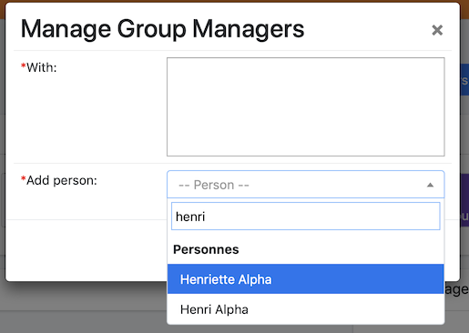
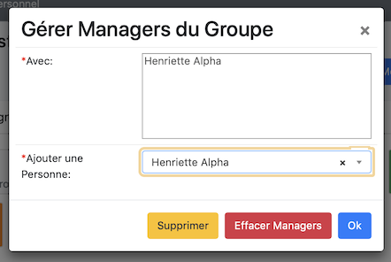
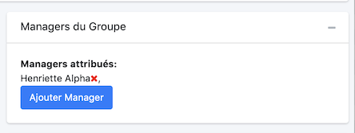

# 
<big>Gestion d'un groupe & Ecclesia**CRM** </big>

Un manager de groupe peut ajouter ou retirer des membres du groupes ou gérer son groupe sans être un administrateur global de tous les groupes.

Un manager peut être défini de manière

- Globale : ce manager pourra définir l'appartenance d'un membre pour tous les groupes
- Locale  : on peut ici définir un manager que pour un groupe spécifique

> Note : un manager de groupe peut ajouter un membre, prééxistant dans le CRM, dans un groupe, mais ne peut créer un membre. Il est possible de qu'une famille s'inscrive de manière automatique dans le CRM (voir pour cela la section famille : auto-inscription).

##Gestion global d'un groupe

Un utilisateur du système peut avoir le rôle : "gestion de groupe"

Pour cela

On édite un des utilisateurs

On lui affecte ce rôle

On coche la case, puis on utilise le bouton "Enregistrer" en bas de page.

##Gestion local d'un groupe

Il faut dans ce cas sélectionner le groupe pour lequel vous aimeriez ajouter un admin local

1. On sélection ensuite l'icône "+" qui permet de déployer le volet permettant d'affecter le manager local

    

2. On clique ensuite le bouton : "Ajouter Manager"

    

3. On pourra ici choisir la personne à affecter.

    

4. Le résultat final :

    

