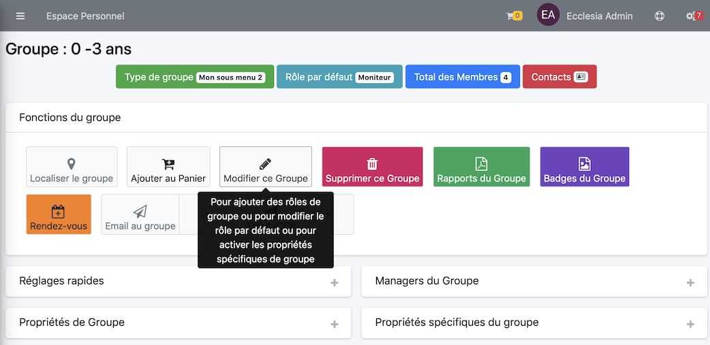

# 
<big>Membres & Rôles & Ecclesia**CRM** </big>

##Changer le rôle d'un membre

On sélectionne le groupe ou on veut changer le rôle d'un membre.

On clique sur le "crayon"

On peut changer, le rôle

##Ajouter un nouveau rôle de membre

On sélectionne le groupe sur lequel on veut travailler

On peut maintenant ajouter le nouveau rôle en bas

**Remarque** les rôles étudiants et moniteurs sont sélectionnés par défaut dans les groupes écoles du dimanche.
