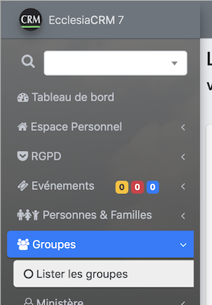
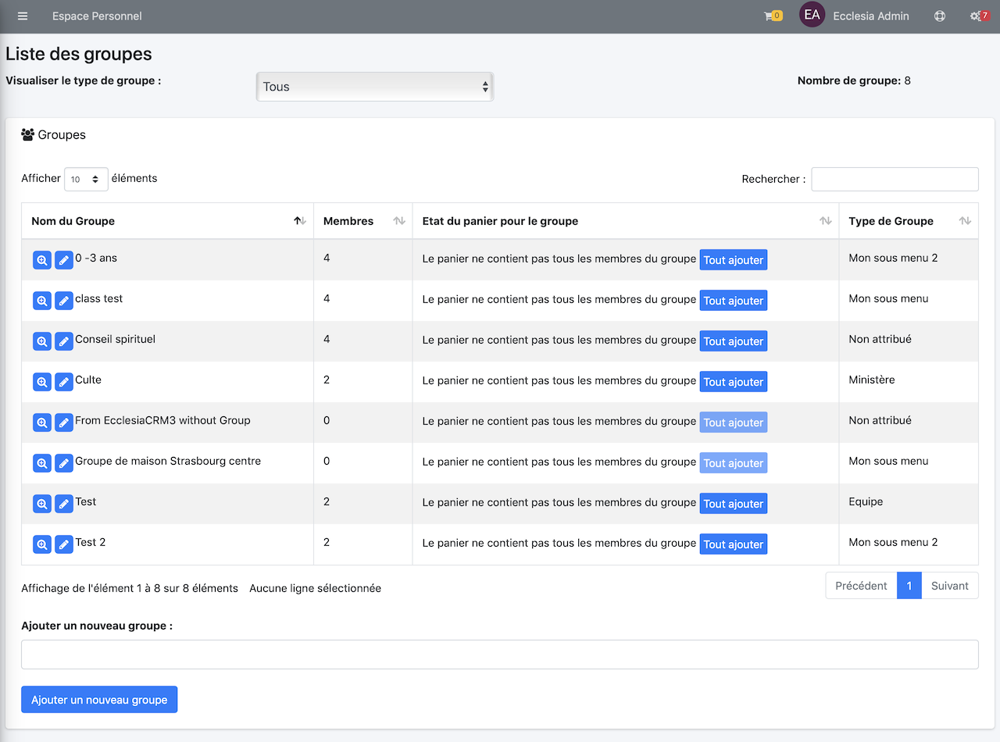
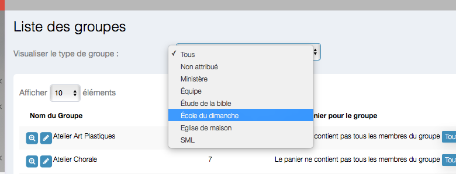
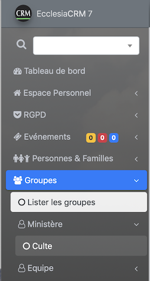
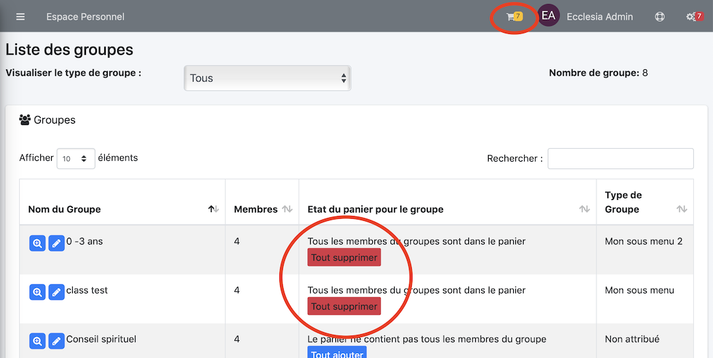

# 
<big>Groupe & Ecclesia**CRM** </big>

## Introduction

Les groupes dans Ecclesia**CRM** ont une place prépondérante dans le fait

- de réunir plusieurs personnes dans un même "container"
- d'envoyer des mails
- de gérer les groupes d'école du dimanche
- de hiérarchiser les menus, via des "types", qui se trouvent dans la barre latérale gauche aussi dans le cas de groupe classique que de groupes spéciaux comme ceux de l'école du dimanche.

Vous pourrez aussi via le "Panier" faire

- des extractions CSV
- imprimer
- un annuaire
- des étiquettes
- des badges
- créer des badges pour QR code
- faire des appels
- créer des groupes de contacts exportables

Voir pour cela la section "Panier"

## Accéder aux groupes

Pour accéder à l'ensemble des groupes, il suffit de déployer la barre latérale comme suit

On sélectionne "Lister tous les groupes" et on obtient

On peut les filtrer par "type"

Ici vous n'aurez que les groupes de type "Ecole du dimanche"

**Remarque** le type de groupe permet de hiérarchiser les groupes dans la barre de menu latéral à gauche

##Ajouter un nouveau groupe

On va au bas de ces groupes

On ajoute

- le nom du groupe
- puis on fait ajouter

##Placer un ou plusieurs membre(s) dans le panier

L'utilisateur doit avoir le rôle panier pour manipuler cet outil.

Aller dans la section Groupe "Lister tous les groupes"

**Remarque**

- Deux groupes sont ajoutés au panier
- l'icône panier contient le compte de personne

Puis consulter la section "Panier" pour cela.

