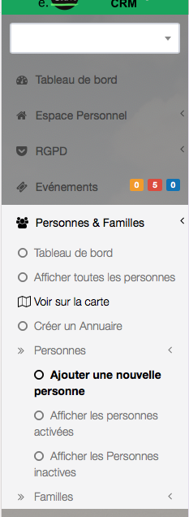

# 
<big>Créer une Personne & Ecclesia**CRM** </big>

##Pour créer une personne

rien de plus simple, aller dans le menu "Personnes & Familles", "Personnes", "Ajouter une Personne".

##Informations

C'est à cette endroit que vous pourrez saisir toutes les informations concernant une personne, le fait 

- qu'elle est souscrit à la NewsLetter, 
- son compte Facebook ID
- Twitter

##Adresse

C'est ici que vous pourrez changer une personne d'adresse, ou lui créer une adresse

## Les champs personnalisables

Si vous avez créé des champs personnalisables, c'est également à cette endroit que vous pourrez les saisir.

