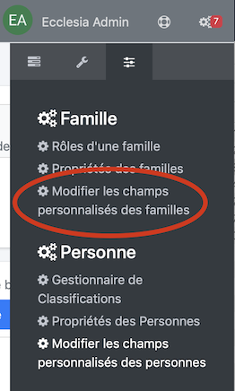
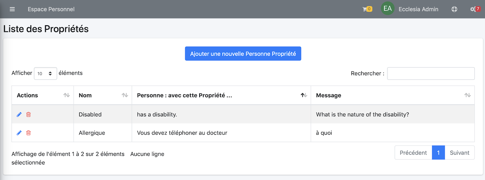
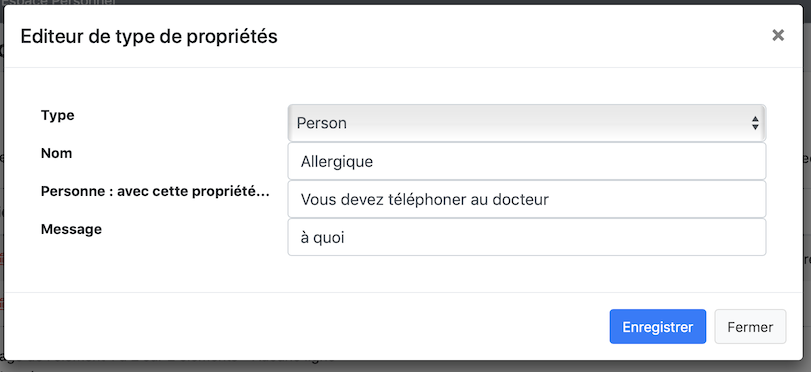
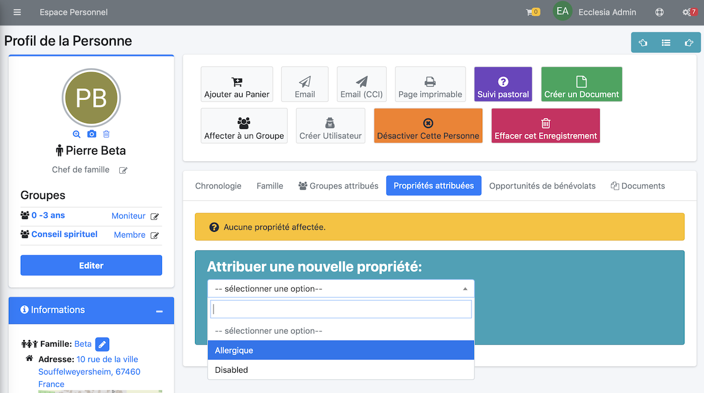

# 
<big>Liste des Propriétés : Personne & Ecclesia**CRM** </big>

Une personne peut être allergique ou ne pas vouloir de photos.

Les propriétés seront visibles dans le cas d'édition de badges pour l'école de dimanche ou des listes.

##Aller dans la partie Réglages

##Réglages

Vous pourrez ici fixer 

- une nouvelle propriété
- la supprimer
- vous pourrez donner des informations supplémentaires : allergique à quoi ...

##Mise en place d'une nouvelle propriété

Vous pourrez fixer ici

- Nom : Allergique
- Message : à quoi
- Le champ : "Un Personne avec cette propriété..." permet de donner une explication.

par exemple :

Voici le résultat

##Ajouter une propriété à une personne

