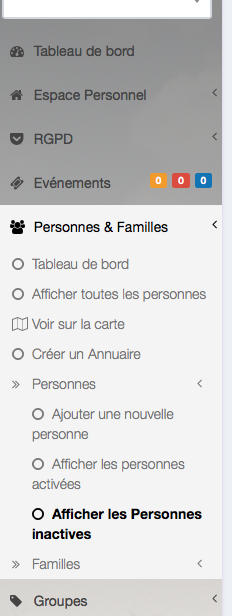

# 
<big>Supprimer désactiver une personne & Ecclesia**CRM** </big>

##Pour supprimer une personne

Vous recherchez une personne via le lien de recherche dans le menu de gauche.

Vous obtiendrez la vue suivante avec ses boutons

La suppression d'une personne peut avoir des impacts au niveau légal.

- dans le cas de dépôt fait par la personne
- de note prise par la personne

##Désactiver une personne

Désactiver une personne, placera cette personne dans les personnes désactivées et ne fera plus partie d'aucune recherche possible dans le cas du RGPD.

Au bout de deux années, la personne passera dans la gestion RGPD et sera administrable via le DPO gérant la partie RGPD.

##RGPD : ATTENTION

**Attention** une personne inactive ne doit pas être réactivée comme cela, sa date de désactivation sera alors fausse. Cela peut engendrer des poursuites judiciares, en raison du RGPD.
