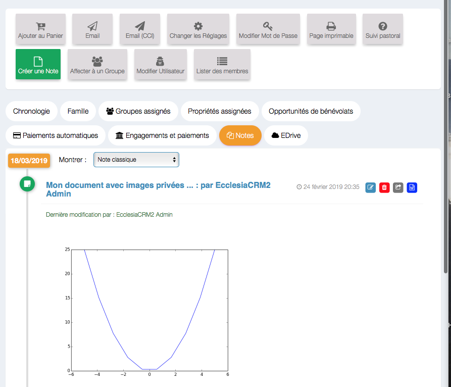

# 
<big>Personne & Ecclesia**CRM** </big>

Ecclesia**CRM** vous permet de créer une personne qui peut être un "utilisateur" du système, membre d'une famille ou d'un groupe.

**NewsLetter** une famille peut recevoir la lettre de news.

##Une personne : une adresse

Chaque personne dans le CRM a une adresse, la notion de famille permet de pouvoir réellement affecter une adresse.

##Une personne : des rôles.

Chaque membre dans la famille a un rôle bien définie

- le représentant familiale
- le conjoint ou la conjointe
- les enfants ...

Le représentant de famille est capitale pour visualiser une famille sur la carte des membres.

##Une personne : une classification

- membre
- un responsable de cellule.
- etc ...

Cette partie est personnalisable dans la partie "Gestion des Personnes" et "Personnalisation".

##Une personne : des propriétés

Une personne au départ doit être pensée avec ces propriétés personnalisables

* Un enfant peut être allergique
* Un membre peut avoir des contraintes personnelles.
* etc ...

Cette partie est personnalisable dans la partie "Gestion des Personnes" et "Personnalisation".

##Une personne : des groupes

Une personne peut faire partie d'un ou de plusieurs groupes.
* Un membre d'un groupe école du dimanche
* Un groupe cellule de maison
* du groupe des anciens.
* etc ...

##Une personne : des champs personnalisables

Il est possible de rajouter autant de champ personnalisables que l'ont veut pour une famille.

Les champs personnalisables sont de type :

- Boolean : 
- Date    :
- Du texte de type 50 ou 100 ou infini en terme de caractères :
- Année   :
- Saison  :
- Nombre  :
- Personne du groupe : 
- Argent  :
- Numéro de téléphone :
- Liste personnalisable déroulante : 

A vous d'avoir des idées.

##Une personne : fonds ou des paiements automatiques (uniquement si la personne n'est pas en famille).

Une personne peut faire des dons, bien entendu et ces dons seront réclamés dans le cas d'un reçu fiscal.

**Rappel** une adresse est un contener ayant des membres. Une adresse sous entend une possibilité de famille.

## Des notes aussi

Une personne peut conserver des notes assez sophistiqués (une forme de document) exportable sous le Drive sous forme de document Word.

## Un EDrive

Nous vous renvoyons à la section "Manuel Utilisateur" et "EDrive dans le CRM" ou en dehors, pour de plus amples informations.