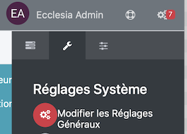
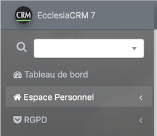

Une fois le RGPD activé, Ecclesia**CRM** nécessitera un réglage fin fait en CA avec le DPO afin de répondre au mieux aux exigences de la législation de chaque pays de l'EU.

## Activation

Avec une nouvelle installation, tout est proposé durant le processus.

Il est également possible de le fair plus tard. Pour cela aller dans :

On choisira l'onglet RGPD

- bGDPR : permet de l'activer ou non
- sGdprDpoSigner : le nom du DPO
- sGdprDpoSignerEmail : son adresse email
- iGdprExpirationDate : la durée au bout de laquelle la personne désactivée basculera dans la gestion DPO pure.

Une fois la fonction activée, un nouveau menu apparaitra

## Menu RGPD

- Au niveau Suivi : Chaque action sur chaque utilisateur est enregistrée, afin de tracer au mieux toute modification faite par un superviseur.

    

- Structure de données

    

Chaque partie de la structure de données doit être justifiée via les commentaires.

**Attention** : tout champ du CRM, chaque propriétés etc ... apparaitra ici et devra être commenté.
Pour valider le commentaire, il suffit de faire un entré avec son clavier.

- Et le dernier point et les familles et personnes désactivés.

Ceci n'est valable qu'au bout de la période fixée : iGdprExpirationDate vu ci-dessus.

**Attention** : une personne ayant fait des dons ne doit pas être purgé du système, pour des raisons fiscales.

