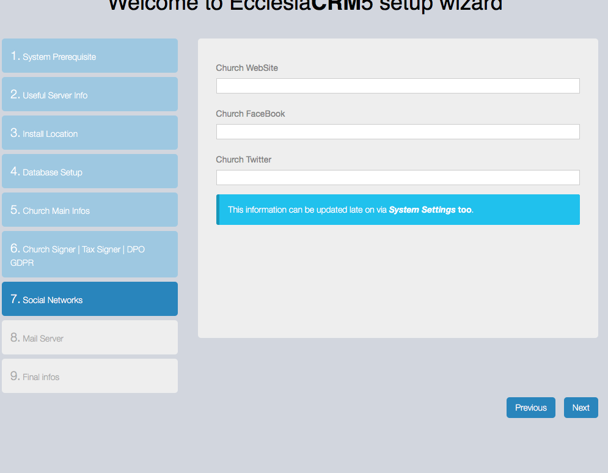
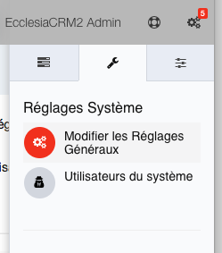
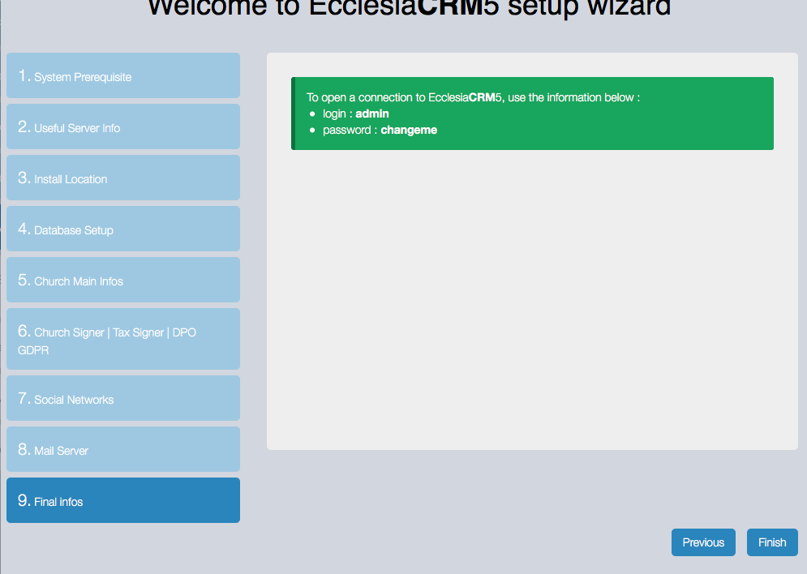
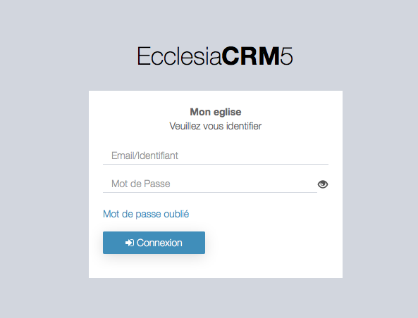

## Installation
* Vous téléchargez l'archive sur git.
* vous copiez ensuite les fichiers sur le serveur.
* Vous vous laissez guider par l'installeur.

##Attention aux éléments requis

  

##Puis on continue

  

##On peut ici fixer le chemin d'accès quand il est non standard

  

##On peut utiliser le localhost ou choisir un nom de serveur avec un port de communication

  

* le nom de la base de données est à fournir
* l'utilisateur et son mot de passe aussi (deux fois)

Vous pourrez tester ici la connectivité à la base de données en cliquant sur le lien : "here"

  

On constate que la base de données est accessible, on peut maintenant continuer.

## Informations importantes

  

Ici, vous mettrez en place

* la langue du CRM :
* Le time Zone est important pour le Drive
* le reste est standard

## Informations légales

Cette partie est importante pour tout ce qui est légale

  

* celui qui sera le responsable légal de tout ce qui est fait sur le CRM (Confirm Signer)  : le pasteur
* celui qui sera le responsable légal pour les rappels de tout ce qui est fait sur le CRM (Reminder Signer) : le pasteur
* Celui qui s'engagera pour toute la partie financière (Tax Signer) : le trésorier par exemple
* GDPR en France c'est le RGPD : attention de bien l'activer
* DPO GDPR Signer : voir pour cela la documentation RGPD, c'est lui qui supervisera toutes les donnés stoquées dans le CRM
* L'adresse email du DPO

## Le reste est plus standard : information de site web etc ....

  

## Important La mise en place de la connexion email

La gestion email est capital dans le CRM, chaque action peut dans le CRM est susceptible d'envoyer un email

* modifier un compte (activer désactiver).
* ajouter des personnes à un événements de calendrier.
* etc ....

  

**Remarque** il est toujours possible de modifier ou d'ajouter ces paramètres par la suite. Il suffit d'aller dans les "réglages généraux" et "réglages email"

  

  

* on peut mettre l'adresse du serveur avec le port de com, comme sur la bulle d'aide
* on demande l'authentification
* le user
* le mot de passe
* le temps de connexion
* l'adresse email
* Pour PHPmailer le paramétrage peut être en TLS (si la connexion au serveur se fait en mode https).

## Paramètres de première connexion

  * On tombe sur l'écran d'accueil

    

  Le login est        : admin

  Le mot de passe est : changeme

* Vous serez invité à changer votre mot de passe à la première connexion.

    
