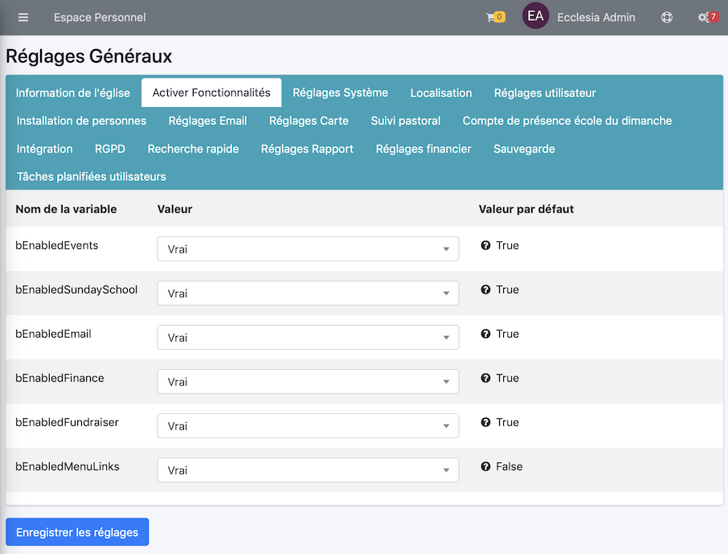
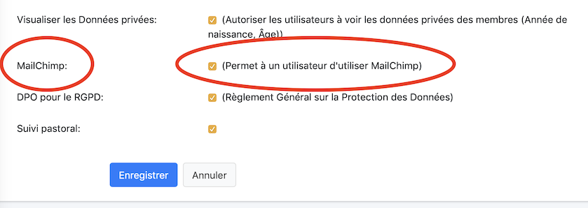
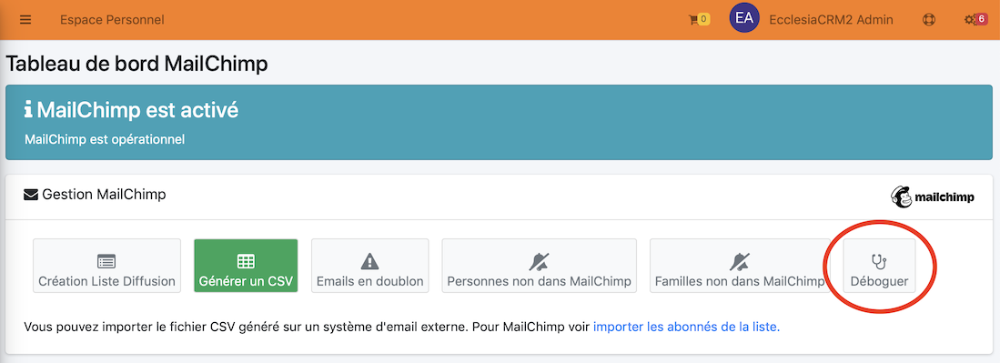
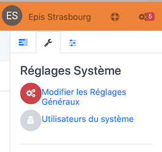

# <center><big>MailChimp & Ecclesia**CRM** </big></center>

Ecclesia**CRM** est pleinement compatible avec MailChimp 

```
Mailchimp a changé et ne plus que créer qu'une seule liste (Audience), dans le cas de sa version gratuite.
Pour contourner le problème il est possible d'utiliser des Etiquettes (Tags).
```


##Activation

Voici la marche à suivre

1. Il faut activer la fonctionnalité dans un premier temps, pour cela, aller dans les réglages généraux

    

2. Puis dans la partie activation

    


##Ajouter le rôle "Mailchimp" à un utilisateur

Pour qu'un utilisateur puisse utiliser le suivi Mailchimp, il faut lui donner ce rôle.

1. Aller pour cela dans
    

2. Sélectionner l'utilisateur, puis vous l'éditerez et lui ajouterez le rôle Mailchimp.

    

3. On coche cette case et on enregistre

    


##Mailchimp : Introduction

Mailchimp est un système de publipostage qui permet d'envoyer une News letter, vous permettant d'envoyer des mails à beaucoup de membres.

Avec Mailchimp, vous pourrez créer

* Vos listes de diffusion (qui sont pleinement RGPD).
* Ajouter des membres du CRM à vos listes.
* Vos campagnes
* Les planifier
* Tout modifier

Et ceci, sans jamais quitter Ecclesia**CRM**.

##IMPORTANT : Vérifier la connectivité de votre CRM

Pour cela aller dans la partie : Email -> Mailchimp -> Tableau de bord



Vous cliquerez le bouton Debug.


##Mise en place : Obtenir une clé Mailchimp

Vous pourrez en obtenir une au lien [suivant](https://mailchimp.com)

##Paramétré Eccelesia**CRM** pour Mailchimp

Puis saisir la clé MailChimp dans Ecclesia**CRM**

1. Pour cela aller dans les réglages généraux **sMailChimpApiKey**
    
2. Puis saisir votre clé MailChimp
    
3. Vous pourrez également fixer le nombre maximum d'abonnés à vos listes **iMailChimpApiMaxMembersCount**
   Il est conseillé, bien entendu de fixer cette valeur assez petite pour éviter que vous soyez considérez comme un spammeur.
4. Il est possible de rajouter les adresses et le numéros de téléphones pour les abonnés, pour faire du vrai mailing, il suffit d'activer maintenant : **bMailChimpWithAddressPhone**

##Résultat


