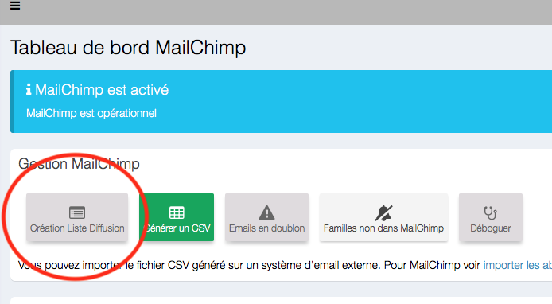
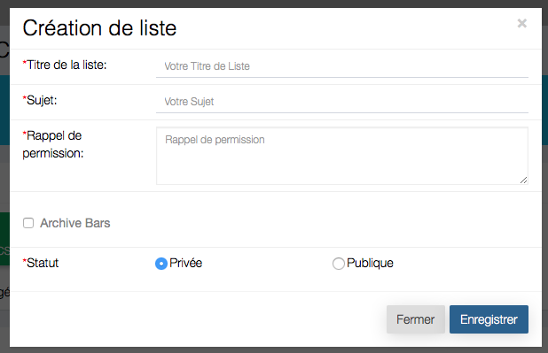
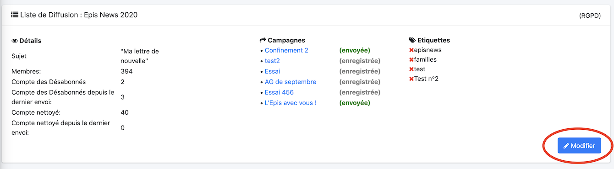
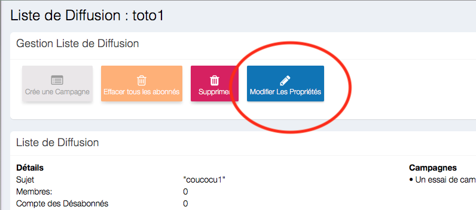
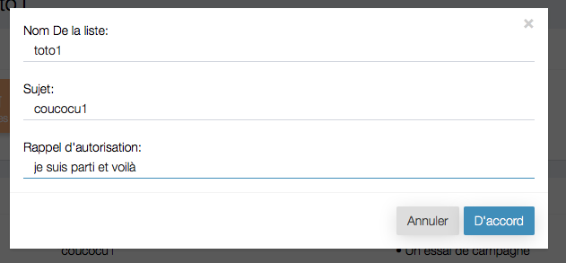
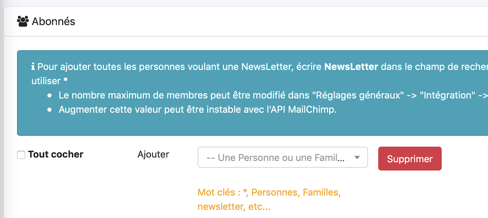

# <center><big>Gestion d'une liste de diffusion sous Mailchimp</big></center>

## Pour créer une liste de diffusion

Il suffit d'aller dans le "tableau de bord" Mailchimp puis de créer une liste avec le bouton suivant :


On obtient la boite de dialogue



* Un titre de liste de diffusion
* Un sujet de campagne de diffusion
* Un rappel d'autorisation ou rappel de permission dans votre campagne d'e-mail permet à vos destinataires de savoir exactement où ils se sont inscrits sur votre liste.
Dans certains cas, cela peut également vous éviter d'être signalé à tort ou mis sur liste noire comme un spammeur. Il est judicieux d'inclure ce rappel pour tenir vos abonnés à jour, surtout si vous n'envoyez pas d'e-mails à votre liste de façon régulière. Mailchimp insère automatiquement votre rappel d'autorisation dans tous nos modèles intégrés pour vous avec la merge tag ```*|LIST:DESCRIPTION|*```.
* Pour l'archive bar, consultez le lien [suivant](https://mailchimp.com/fr/help/hide-content-in-email-campaign-archives-and-pages/)


## Ajouter des membres à votre liste

Dans l'ensemble des listes, choisissez-en une et cliquez le bouton "Modifier"



Il est toujours possible de modifier, le nom de la liste, ou les autres propriété, en utilisant le bouton



Il suffit d'utiliser la boite de dialogue suivante 



Puis en bas de page, 


vous aurez plusieurs possibilités

- Ajouter un membre
- Une famille
- Tous les membres d'un groupe
- Tous les membres du CRM en écrivant : *
- Ou pour finir les membres ayant souscrits à la NewsLetter, en écrivant : NewsLetter

## Modifier le statut d'un abonné

Vous pourrez modifier un abonné d'un statut "abonné" à "désabonné" en sélectionnant un membre dans la liste et en cliquant sur le crayon


Puis il suffit de sélectionner le statut comme suit


## Modifier le statut de plusieurs abonnés

Sélectionner plusieurs membres


Puis cliquer le menu et choisir l'option désirée


## Supprimer un membre de la liste de diffusion

Il suffit de cliquer sur la corbeille figurant à côté de la corbeille


## Supprimer plusieurs membres de la liste de diffusion

Sélectionner plusieurs membres


Il suffit de cliquer sur le bouton supprimer




