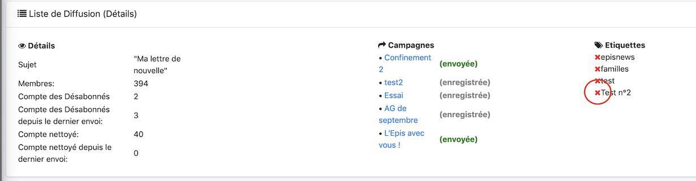
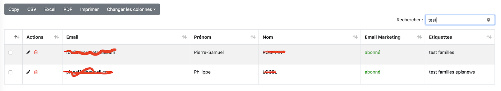
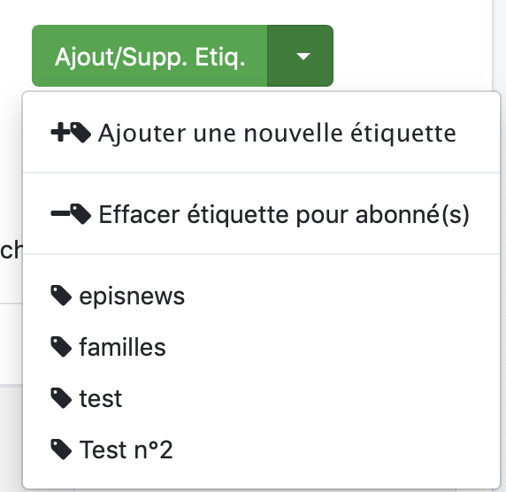

# 
<big>Gestion des étiquettes (Tags) d'une liste de diffusion sous Mailchimp</big>

Les tags sont le moyen de pouvoir, dans une même liste, trier les membres et de créer une campagne en fonction d'eux

* il est possible de créer une campagne avec tous les membres
* juste avec une étiquette (tag)

Voici dans la liste deux étiquettes qui ont préalablement été créées

## Créer un tag (une étiquette) dans une liste de diffusion

Une liste doit avoir été créée
 
Vous devez dans un premier temps, ajouter des membres à cette liste.

Il faudra ensuite, en sélectionner un ou plusieurs

Puis on peut ajouter une nouvelle étiquette (tag)

Saisir un nom pour le tag

## Supprimer un tag (une étiquette) pour un ou plusieurs membre(s)

Vous pouvez saisir les membres classiquement

Il suffit de choisir le menu : "Effacer Etiquettes"

## Supprimer le tag (étiquette) de la liste de diffusion

Il suffit pour cela de cliquer la croix ici

Vous aurez alors supprimer l'étiquette pour tous les membres et de la liste de diffusion

