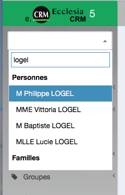
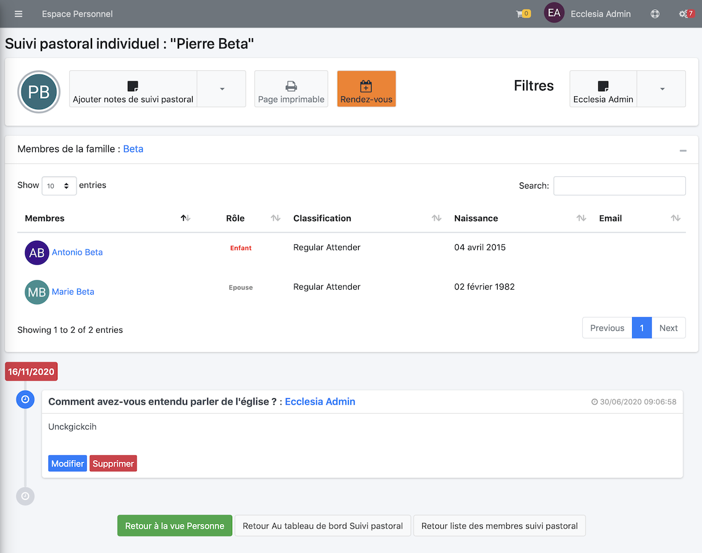
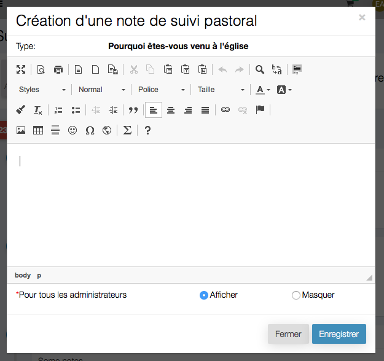
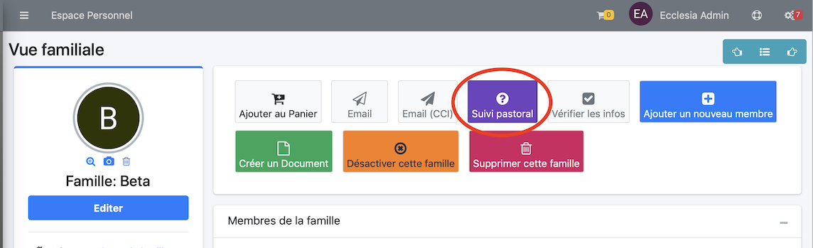
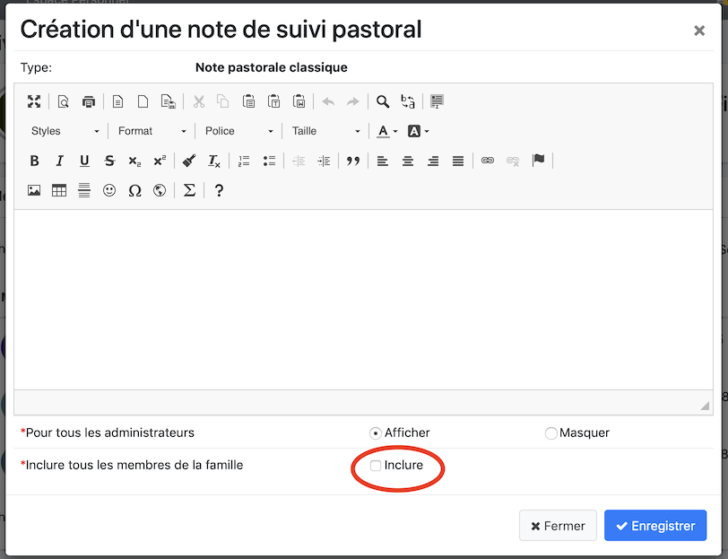

# 
<big>Pastoral care for Person or Family</big>

Chaque pasteur, conseiller en relation d'aide, ou même responsable autorisé a la possibilité de pouvoir gérer le suivi pastoral.

## Créer une note de suivi pastoral

Dans un premier temps, rechercher un utilisateur avec le menu dans la barre latérale gauche

Voici son profile

On clique sur le bouton ci-dessus et on peut commencer le suivi pastoral

La vue se sépare en deux parties

- les boutons qui permettent de choisir le type, de l'imprimer ou de filtrer les note prises par ceux ont fait le suivi pastoral.
- voici les types prédéfinies, vous pourrez dans la partie personnalisation en rajouter

- Sélectionnons par exemple : Pourquoi êtes-vous venu à l'église dans le petit menu 
 
    - Il sera possible dans la fenêtre ci-dessus, de glisser déposer des images documents dans la zone
    - d'utiliser
    - d'utiliser des modèles de documents [Modèle](../../user-guide/doc-person/doc-person-document-templates.md)
    - de mettre en place des tableaux
    - etc ...

**Remarque** Vous remarquerez les boutons radio "Afficher" "Masquer", une autre personne n'aura pas toujours besoin de visualiser les notes prises par un autre pasteur ou une personne ayant fait un suivi en relation d'aide.

**Il est important par exemple de savoir que la personne a été suivi mais pas de voir les notes prises durant le suivi.**

- Voici le résultat après saisie

##Make a pastoral care note for a family

Vous pourrez également fait un suivi pastoral pour une famille :

- Rechercher et choisir une famille
- et utiliser la même méthode que pour une personne

Vous pourrez ajouter le même commentaire pour chaque membre de la famille en cliquant "Inclure" :

## Filtrage par pasteur ou conseiller

Pour cela, prenez le bouton de droite.

