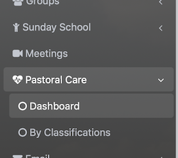
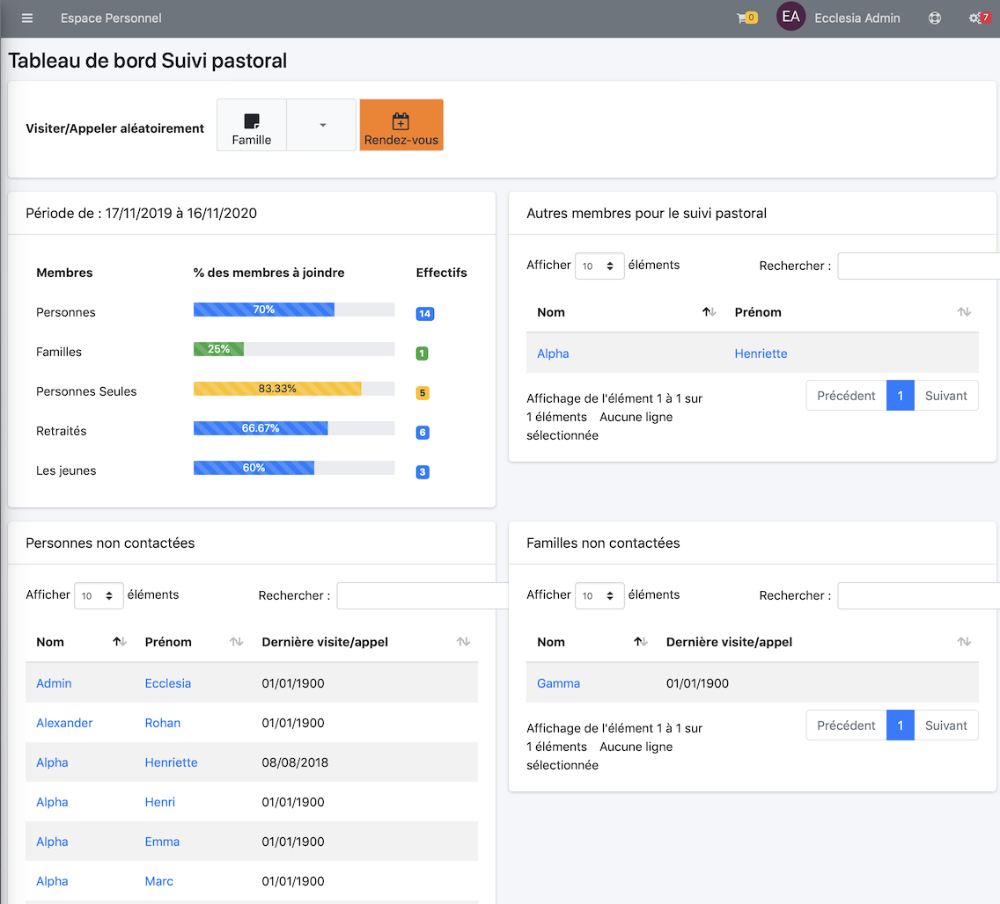
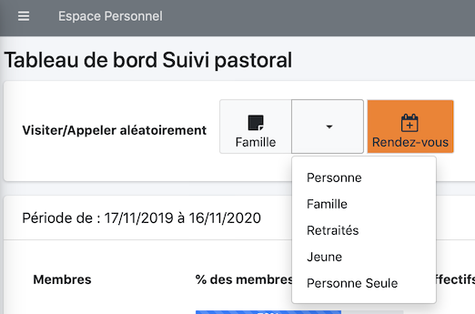

# 
<big>Tableau de bord : Suivi pastoral</big>

Chaque pasteur, conseiller en relation d'aide, ou même responsable autorisé a la possibilité de pouvoir gérer le suivi pastoral.

##Tableau de bord principal succinct

Quand vous ouvrez une session

Vous pourrez noter la couleur rouge du panneau d'alerte de suivi pastoral

- rouge signifie: moins de 10% de votre église a été contacté
- jaune signifie: moins de 30% de votre église a été contacté
- bleu  signifie: moins de 60% de votre église a été contacté
- vert  signifie: votre église est bien suivie

En cliquant le bouton "Gérer le suivi pastoral" vous obtiendrez de meilleures informations sur la santé de votre église.

##Tableau de bord principal complet

Pour avoir des informations complètes sur la santé de votre église, allez dans la barre de menu

Vous obtiendrez la vue suivante, avec tous les détails nécessaires

## Appelez/contactez aléatoirement, une personne seule, une famille etc ...

En utulisant le menu : "Visiter/Appeler aléatoirement"

Pour une personne seule vous obtiendrez

