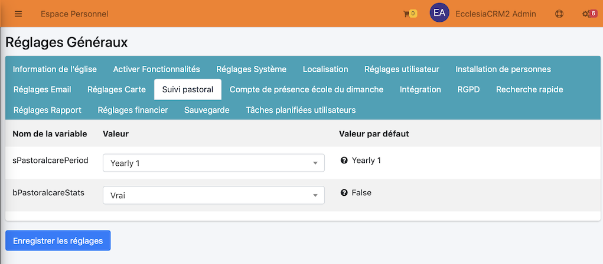

# 
<big>Tableau de bord : Suivi pastoral</big>

Chaque pasteur, conseiller en relation d'aide, ou même responsable autorisé a la possibilité de pouvoir gérer le suivi pastoral.

##Gestion de la période de suivi

Pour gérer la période de suivi

Puis choisir l'onglet "Suivi Pastoral"

Trois types de suivi est possible

- pour les 365 derniers jours
- de septembre à septembre
- de janvier à décembre

Le deuxième argument "bPastoralcareStats" permet de consulter les stats pour chaque pasteur durant la période.

>Note: il permet de consulter son propre suivi ou de reprendre le suivi d'un collègue pasteur (voir pour cela plus bas)

##Tableau de bord principal succinct

Quand vous ouvrez une session

Vous pourrez noter la couleur rouge du panneau d'alerte de suivi pastoral

- rouge signifie: moins de 10% de votre église a été contacté
- jaune signifie: moins de 30% de votre église a été contacté
- bleu  signifie: moins de 60% de votre église a été contacté
- vert  signifie: votre église est bien suivie

En cliquant le bouton "Gérer le suivi pastoral" vous obtiendrez de meilleures informations sur la santé de votre église.

##Tableau de bord principal complet

Pour avoir des informations complètes sur la santé de votre église, allez dans la barre de menu

Vous obtiendrez la vue suivante, avec tous les détails nécessaires

##Suivi plus fin des membres

On a ci-dessous le nombre d'appels ou visites effectués durant la période fixée pour le suivi pastoral (voir plus haut pour les réglages).

>Note: Les stats permettent de pouvoir suivre son propre suivi ou de reprendre le suivi fait par un autre pasteur ou conseiller.
>Pour cela cliquer simplement sur le lien des stats, vous obtiendrez une vue qui listera tous les membres suivis durant la période annuelle.

## Appelez/contactez aléatoirement, une personne seule, une famille etc ...

En utulisant le menu : "Visiter/Appeler aléatoirement"

Pour une personne seule vous obtiendrez

>Astuce : il est préférable de passer par une famille, vous pourrez cocher tous les membres de celle-ci et obtenir un meilleur score au final.

