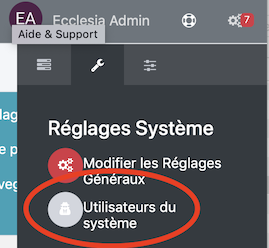
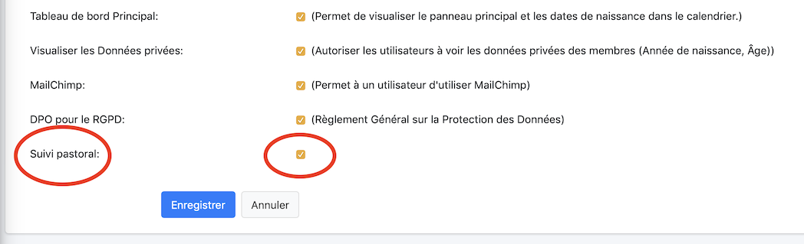

# 
<big>Suivi pastoral pour une personne ou une famille</big>

Chaque pasteur, conseiller en relation d'aide, ou même responsable autorisé a la possibilité de pouvoir gérer le suivi pastoral.

##Activer le suivi pastoral pour un utilisateur du système

Pour qu'un utilisateur puisse utiliser le suivi pastoral, il faut lui donner le rôle de suivi pastoral.

Aller pour cela dans

Sélectionner l'utilisateur, puis l'éditerer et lui ajouterer le rôle suivi pastoral.

On coche cette case et on enregistre

Cet utilisateur pourra maintenant ajouter une note de suivi pastoral.

