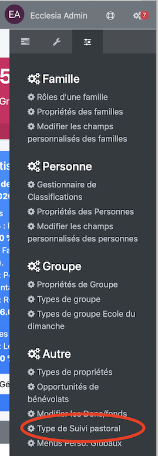
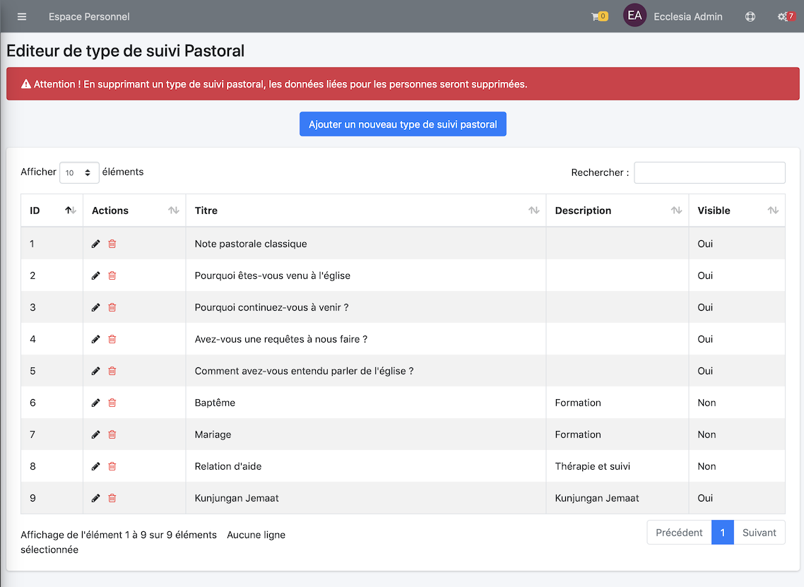

# 
<big>Personnalisation suivi pastoral & Ecclesia**CRM** </big>

Vous pourrez ici rajouter des propriétés au niveau du suivi pastoral

- elles pourront être visible ou non par un autre pasteur ou conseiller

## Comment y accéder ?

Aller dans :

Vous pourrez ici créer un nouvel intitulé de note de suivi pastoral

## Droits

En cochant la case, tous le monde pourra voir les notes de suivi. Dans le cas d'un entretien pastoral, il n'est pas forcément souhaitable que tout pasteur puisse consulter tout suivi.
