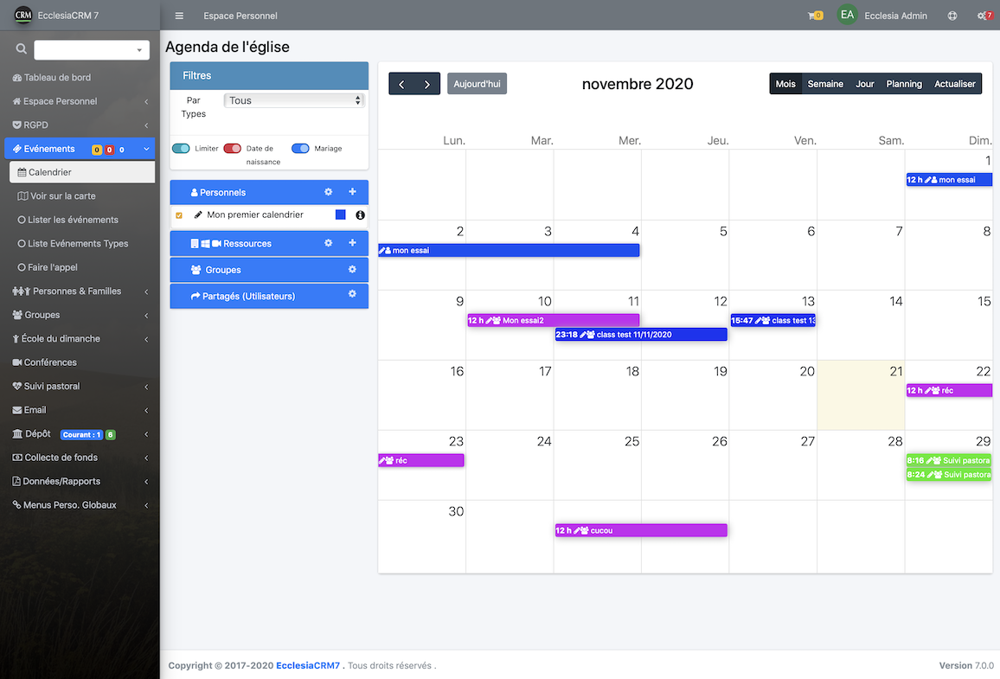
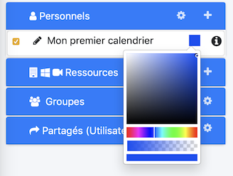
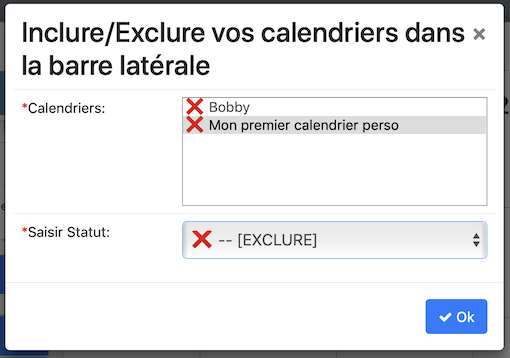

Un utilisateur peut créer des calendriers personnels les lire sur son smartphone ou à d'autres utilisateurs

## Calendriers

   Pour y accéder, aller dans la barre latérale et choisir Evénements et calendrier

  

Il y a trois type de calendrier :

- les personnels.

- les groupes.

- les réservations.

- les partagés.

## Pour ajouter un nouveau calendrier
- Cliquez sur le "+"

  

- Il suffit de choisir un nom

## Modifier sa couleur

- On clique sur l'icône du calendrier

  

- Vous choisissez la couleur voulue

  

- le résultat est immédiat à droite.

## Inclure/exclure ses calendriers

1. Vous pourrez inclure ou exclure des calendriers :

    -  Pour cela cliquez sur la roue crantée

       

    - Sélectionnez le calendrier à inclure/exclure

       

    - Vous obtiendrez

       

    - Dans la barre latérale le calendrier est masqué et non supprimé

       

## Pour supprimer un calendrier

1. Aller dans la partie gestion, c'est la deuxième roue crantée

  

2. Cliquer sur supprimer

  

##Remarques

Vous constaterez deux liens dans cette fenêtre :
- Un qui est un lien pour le calendrier de partage dans le cas ou le serveur est compatible CalDaV.
- L'autre est toujours accessible du moment que les réglages administrateurs le permettent, pour cela aller dans la partie des réglages particuliers du manuel administrateur.
