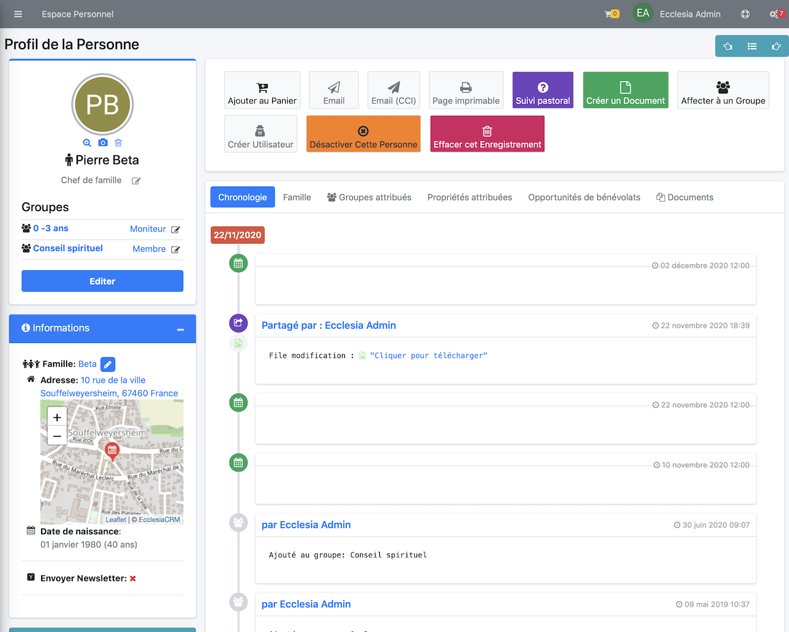
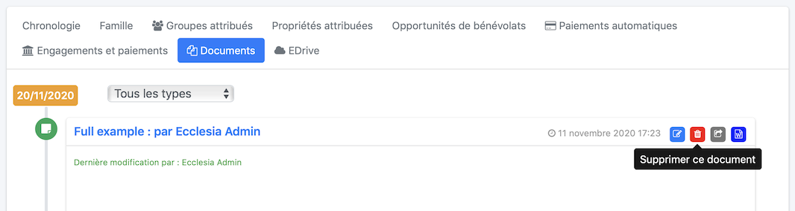
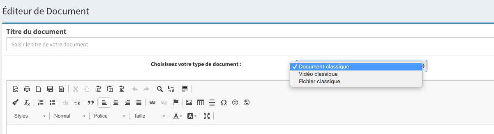
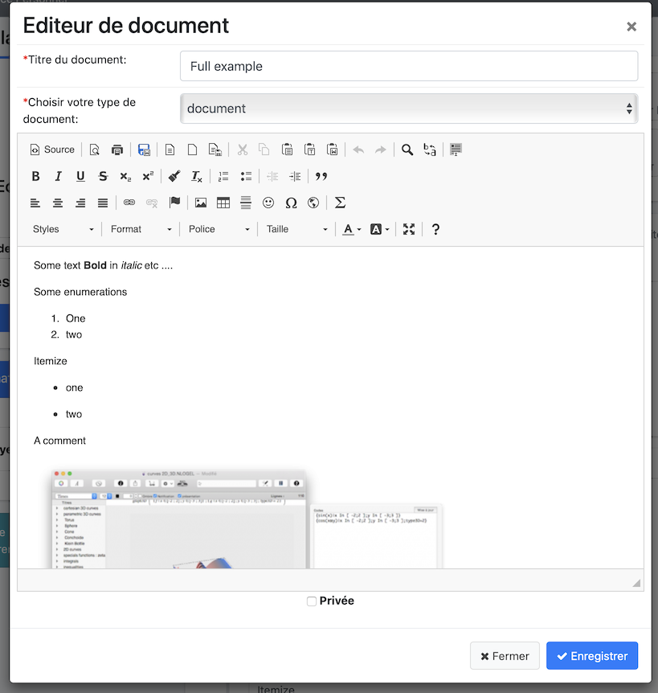
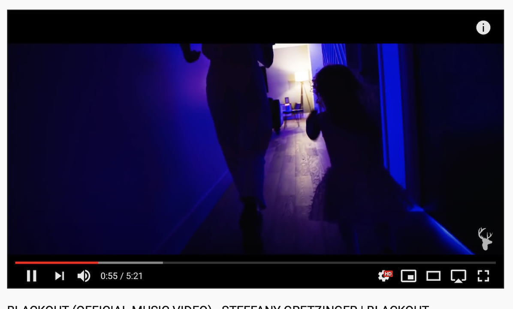
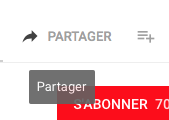
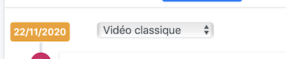
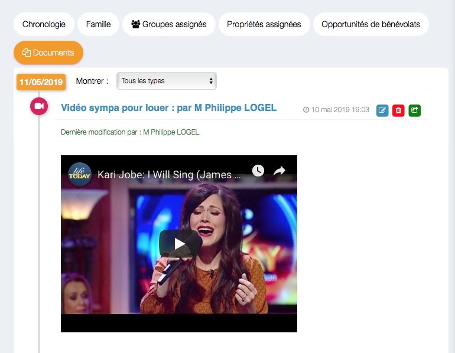

Il est possible depuis la version 4.1 d'EcclesiaCRM de gérer les modèles de document.

## Visualiser tous ses documents

1. Pour cela aller dans votre espace personnel

      

2. Cliquez l'onglet Documents

      

3. Voici la liste des documents

      

4. Il est possible de les trier par type

      

##Ajouter

1. Aller dans un document, CKEditor

    - Pour cela aller dans votre personnel

       

2. Ajouter un document

   

##Modifier

Cliquez l'icône

##Suppression

Cliquez l'icône

##Il est possible de créer trois types de document

1. les documents classiques Vous disposez ici d'un vrai traitement de texte. Il est possible de travailler en plein écran. 
     
      c'est un document CKeditor visible que dans le cas du CRM. Vous pourrez le formater comme bon vous semble.

2. les vidéos
      c'est en fait un document CKEditor classique qui a le type vidéo.

      - Pour rajouter une vidéo Youtube, la procédure est complexe en raison de restriction forte youtube.
      - Aller sur youtube

        

      - cliquer sur le lien "Partager"

        

      - cliquer sur le lien "Intégrer"

        

      - Il faut copier le lien comme ci-dessous

        

      - On revient sous EcclesiaCRM, et on créé un document comme au premier point en choisissant comme type : "Vidéo Classique"

        

      - On clique l'icône

        

      - Colle le lien en complétant

       

      - On donne un nom au document

      

      - voici le résultat

3. les fichiers audios classiques

      c'est en fait un document CKEditor classique qui a le type audio, ce n'est utile que pour le référencement.

## Remarque

- Vous faire de même avec les calendriers groupes et partagé.
- Un calendrier groupe ne peut être rajouté que par un admin.

