Il est possible depuis la version 5.0 d'Ecclesia**CRM** de gérer des fichiers via un gestionnaire de fichiers.

EDrive possède une partie publique (public) et privée qui sont deux dossiers foncièrement différents et qui

- permettent dans tout ce qui est public d'avoir le lien en clair (utile pour MailChimp pour ses images et ses documents, pour les événements, et pour partager un fichier avec quelqu'un en dehors du CRM).

- dans tous les autres cas, les fichiers ont une url qui ne sera valable que durant la connexion et inactive déconnecté.

## Visualiser tous ses documents dans son Edrive

1. Pour cela aller dans votre espace personnel

      

2. Cliquez l'onglet EDrive

      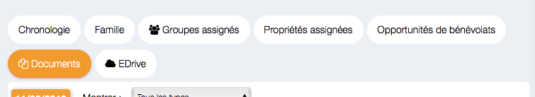

3. Ou vous pourrez y accéder comme cela

      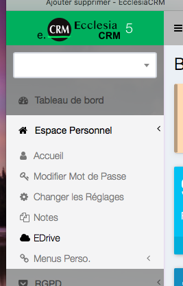

Vous constaterez que de base vous avez un dossier Public (ce dossier est capital pour Mailchimp).

Ce dossier sera utile pour joindre des images ou document avec vos campagnes de mailings.

## Ajouter un fichier à votre EDrive

1. Pour cela cliquer l'icône 
       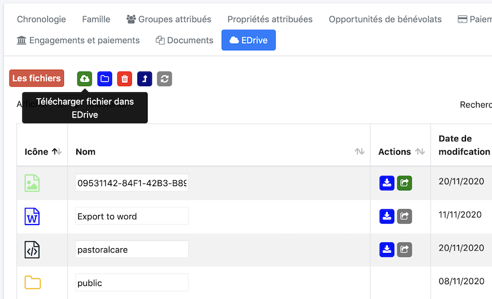

2. Une boite de dialogue va s'ouvrir 
       

3. Vous pourrez le ou <u>les</u> fichiers pour les télécharger sur le serveur dans votre espace personnel 

4. Choisir les fichiers 
       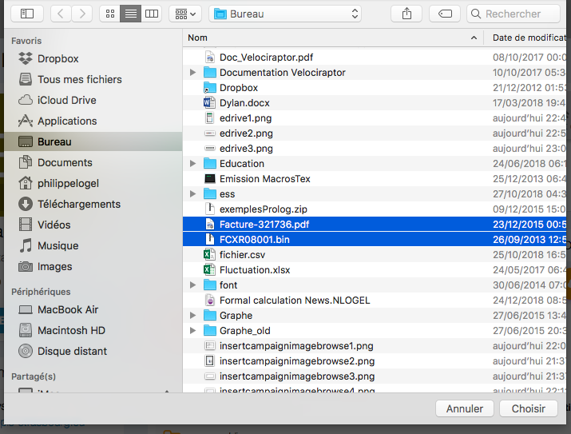

5. Vous constaterez qu'ils sont présents 
       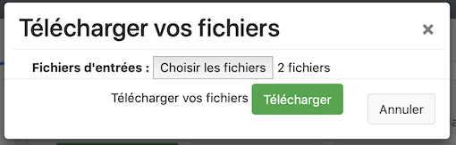

6. Attendez un peu et ils seront présents sur le serveur 
       

**Remarque**

Vous constaterez que le dossier public est utilisé ici.

## Visualiser le contenu du fichier

Le petit "EDrive" est un vrai drive, cliquez sur la ligne

- Pour un fichier PDF 
       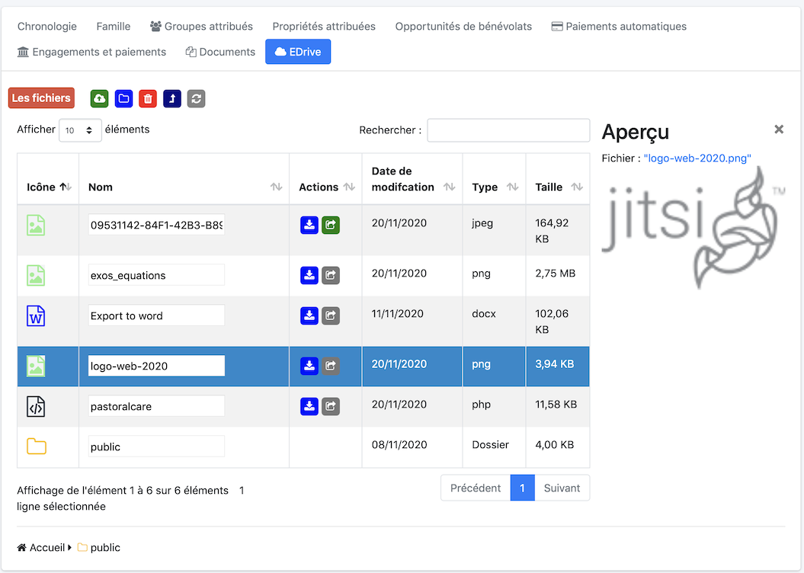

- Pour un fichier Image 
       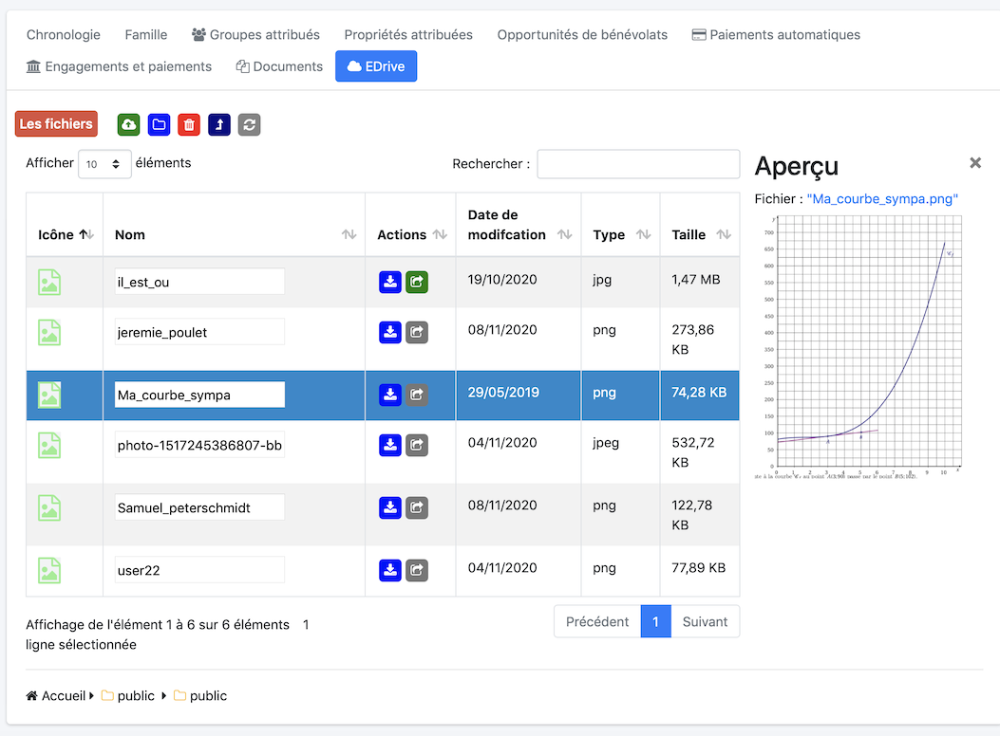

- Vous pourrez prévisualiser des vidéos ou des fichiers mp3, etc ...

## Création d'un dossier

La démarche est simple

- Sélectionner le bouton suivant 
       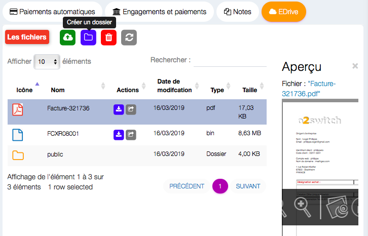

- Saisissez le nom de dossier voulu 
       

- Et vous obtiendrez le dossier voulu 
       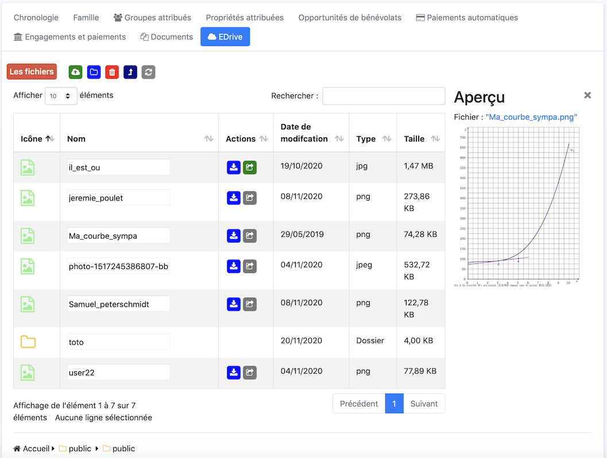

## Modifier le nom d'un fichier ou d'un dossier

- Il suffit de double cliquer le nom du dossier ou du fichier 
       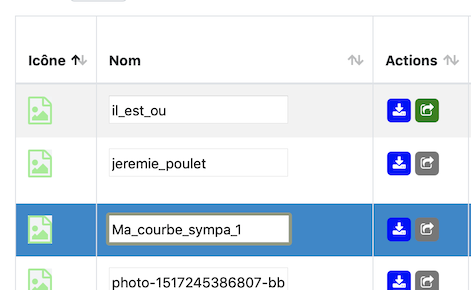

- Saisissez le nouveau nom désiré 
       

- Valider avec la touche entrée ou retour chariot 
       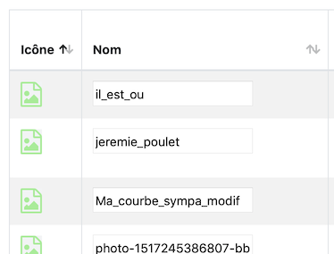

## Pour déplacer un fichier dans un dossier

- Sélectionnez l'icône et la déplacer dans le dossier voulu 
       

- Le drop est fait 
       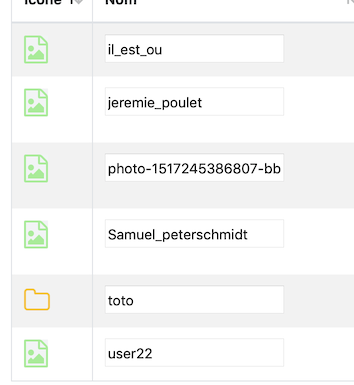

- Pour aller dans le dossier voulu, double cliquer l'icône du dossier 
       

## Pour remonter d'un dossier

C'est assez simple on clique l'icône suivante : 

## Pour faire remonter un fichier d'un cran dans le dossier parent

On glisse et on dépose l'icône du fichier ou dossier sur 

Le fichier ou le dossier remontera dans le dossier parent.

## Pour supprimer un élément

On a deux choix possibles :

- on sélectionne l'élément et on le glisse dépose sur l'icône de la corbeille 
- ou on sélectionne et on clique : 

En conclusion c'est un vrai gestionnaire de fichier.

Au final, EDrive est aussi via WebDav comme NextCloud ou OwnCloud .... EcclesiaCRM est donc un Cloud.
