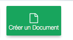
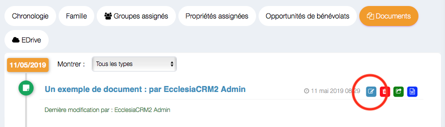
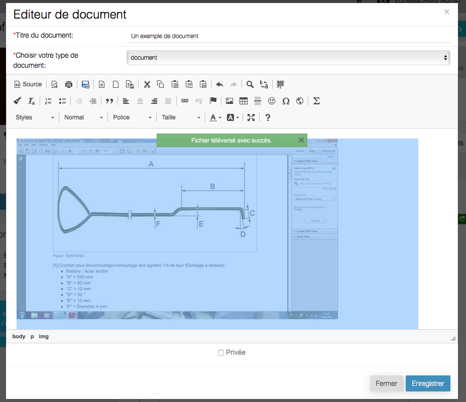
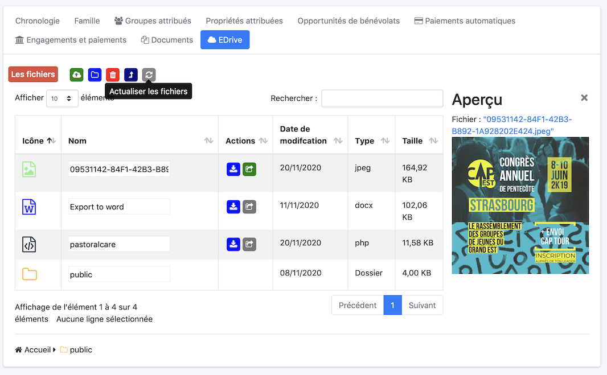
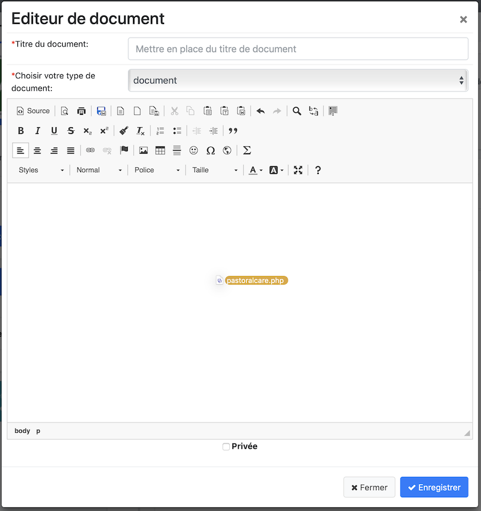
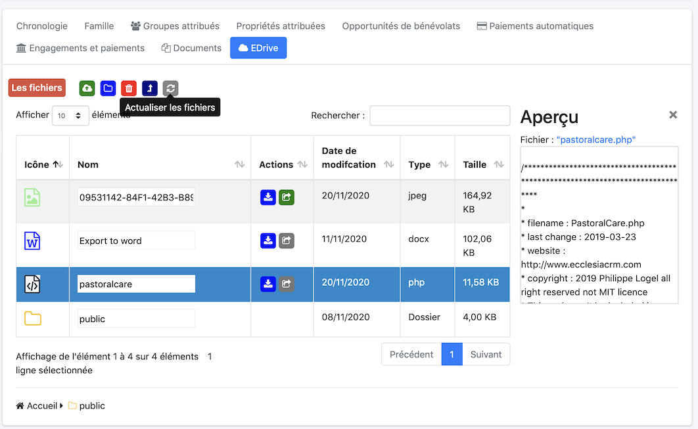
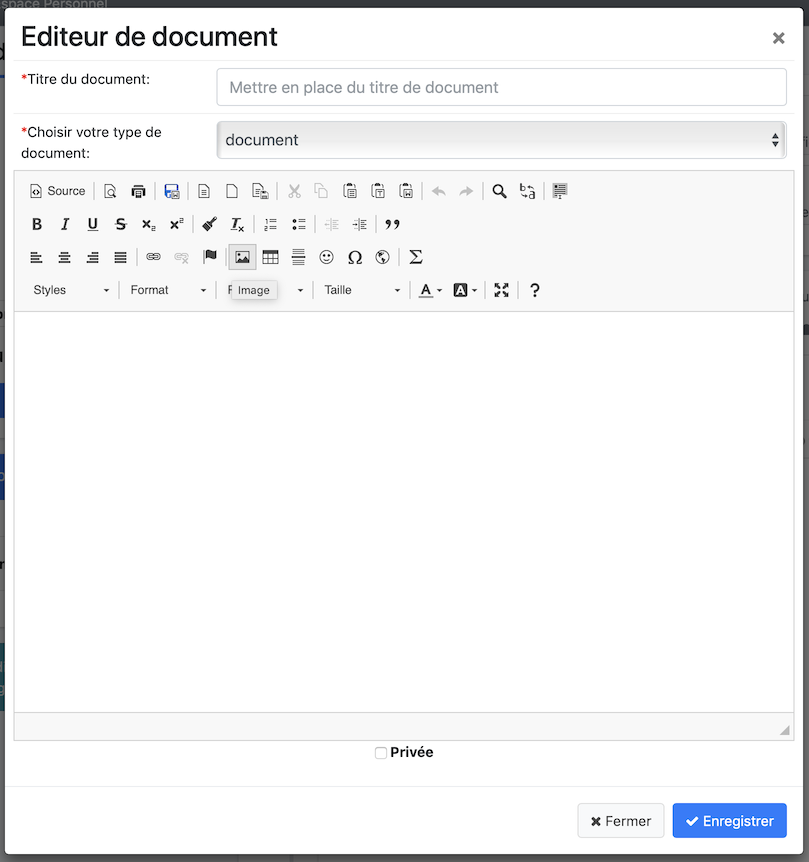
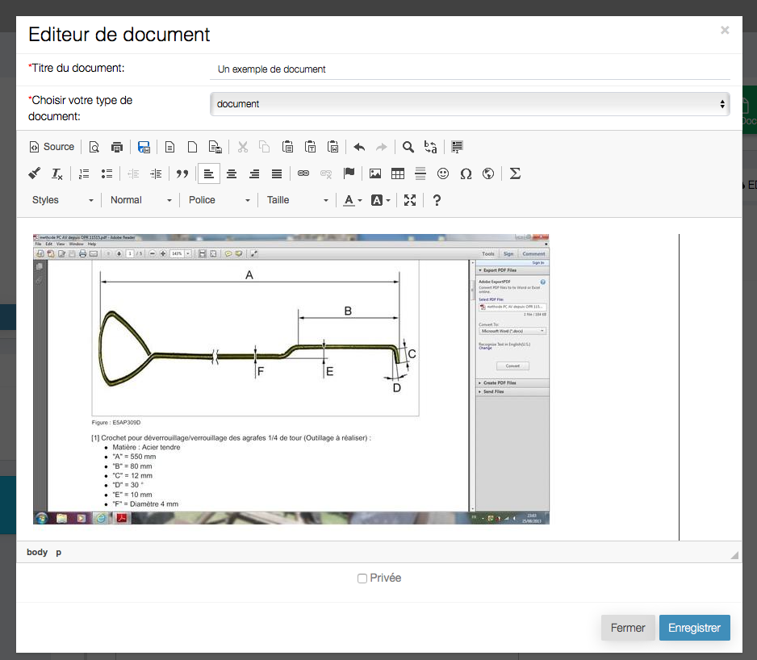
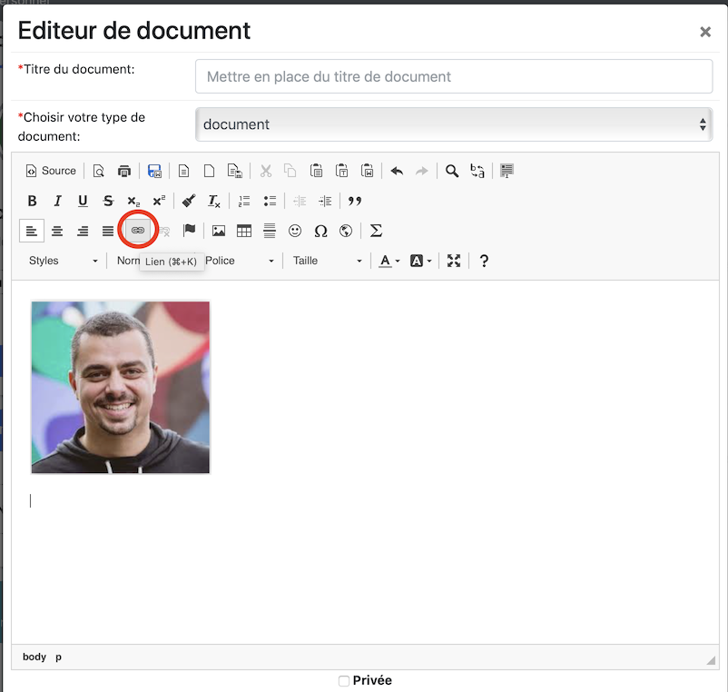

Depuis la version 5.5.0 d'EcclesiaCRM permet de gérer dans la zone de texte de vos documents

- le glisser déposer d'images
- les boites de gestion d'images et de lien intègre maintenant l'EDrive

Pour cela

## Créer ou Editer un document

1. Aller dans un document, CKEditor

    - Pour cela aller dans votre personnel

     

2. Ajouter un document

     

## Edition

Cliquez l'icône

## Glisser déposer d'images

Une fois le document ouvert, glisser déposer le fichier sur le document

Voici le résultat

Ou se trouve le fichier .... dans votre EDrive, si le rôle est activé EDrive est activé (*)

**Remarque** vous pourrez actualiser le drive avec le bouton ci-dessus.

## Glisser déposer des fichiers

Une fois le document ouvert, glisser déposer le fichier sur le document

Voici le résultat

Ou se trouve le fichier .... dans votre EDrive, si le rôle est activé EDrive est activé (*)

**Remarque** vous pourrez actualiser le drive avec le bouton ci-dessus.

## Inclure des photos de votre EDrive (*)

Pour cela sélectionnez

Puis cliquez

Choisir la ligne

Vous pourrez maintenant cliquer l'icône

On peut ensuite gérer les dimensions et toutes les options standards CKEditor. Vous remarquerez que le lien est dépendant d'une API.
Vous remarquerez que le lien est dépendant d'une API (**)

Et voilà

## Inclure des fichiers de votre EDrive (*)

Pour cela sélectionnez

Puis cliquez

Choisir la fichier dans EDrive comme pour les images et vous obtiendrez

On peut ensuite gérer ici, le nom du lien dans la page
Vous remarquerez que le lien est dépendant d'une API (**)

Et voilà le résultat

** Remarque **

(*) pour activer le rôle EDrive aller dans "Réglages Systèmes" -> "Utilisateurs du système"

Editer ensuite l'utilisateur et ajouter le rôle.

(**) les liens vers le document sont via une API, sauf si les documents se trouvent dans le dossier public.

Dans ce cas les liens seront en clair (c'est utile pour MailChimp ou pour partager un document avec quelqu'un d'externe au CRM).
