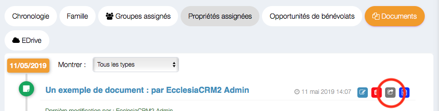

Un utilisateur a la possibilité de partager ses documents avec tous les autres utilisateurs.

## Partager un document

1. Pour cela aller dans votre espace personnel

      

2. Aller dans l'onglet Documents

      

3. Vous constatez que vous avez une icône à côté de la date de création

      
      
4. Sélectionnez la dernière icône

      
      
5. Il suffit de choisir le nom :

    - d'une personne 
    - d'une famille
    - d'un groupe

      Vous constaterez qu'un document partagé a une icône qui est passée au vert.
      
      
    
6. Il est possible ensuite de fixer les droits pour chacune des personnes affectées.

      

## Remarque

- Avec cette dernière boite de dialogue, il est possible de supprimer soit des personnes du partage.
- Il est possible de supprimer également le partage via ce même panneau.

