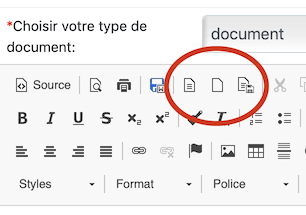
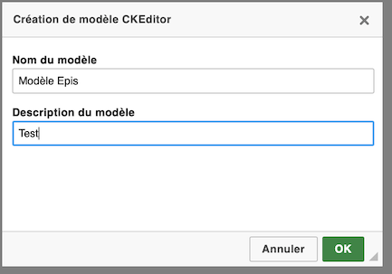
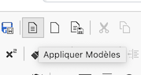

Il est possible depuis la version 4.1 d'EcclesiaCRM de gérer les modèles de document.

## Création

1. Aller dans un document, CKEditor

    - Pour cela aller dans votre personnel
       
       

2. Ajouter un document
    
       

3. Vous disposerez de toute une série d'icônes, notamment les trois permettant de gérer les modèles

       
      
4. Le créer

    - dans un premier temps, formater votre document comme bon vous semble.

       
       
    - Vous pourrez ensuite le rajouter à la liste de vos Modèles
    
       
     

5. Gestion des profiles

    - quand un profile est créé, il est possible de le renommer ou de le supprimer

       
    
    - Vous pourrez le renommer ou le supprimer facilement
    
       

6. Appliquer

       

## Remarque

- Vous faire de même avec les calendriers groupes et partagé.
- Un calendrier groupe ne peut être rajouté que par un admin.

