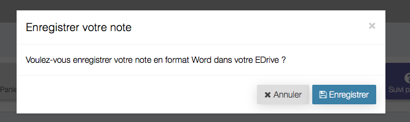
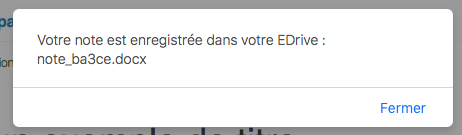
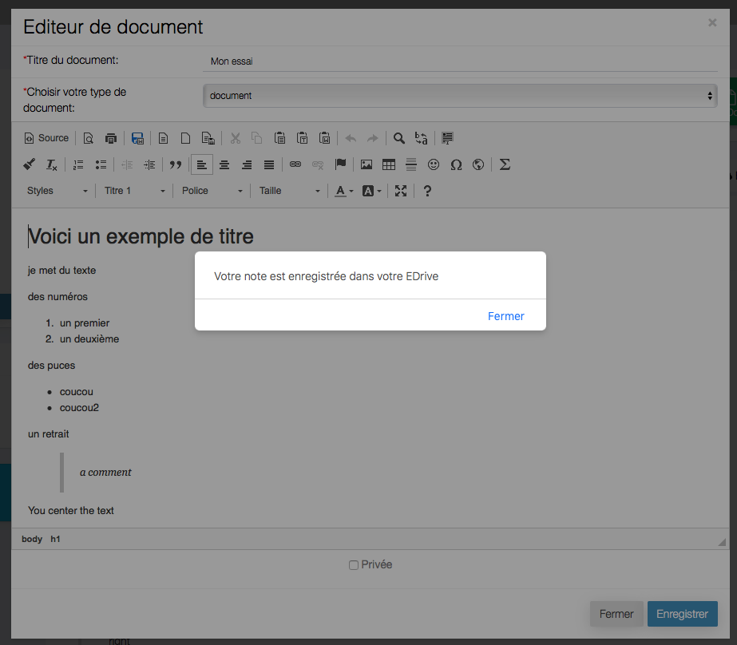
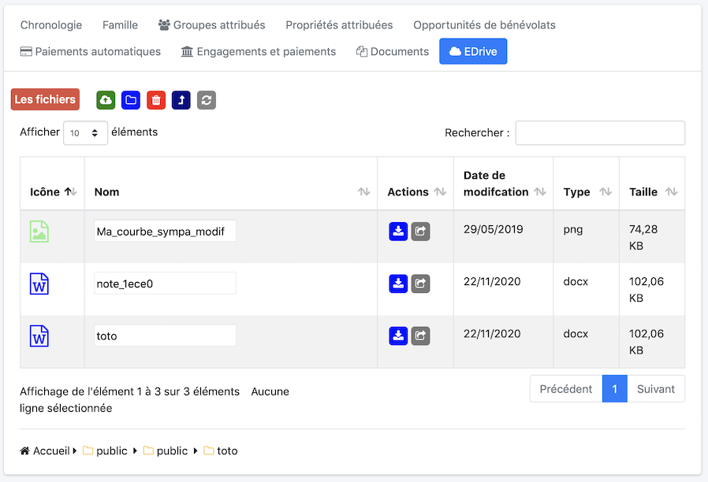
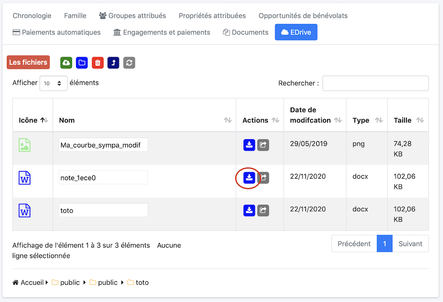

Il est possible depuis la version 5.1.0 d'EcclesiaCRM d'exporter les documents sous format word dans l'EDrive

## Export du document créé

1. Aller dans l'espace de document, et cliquer l'icône Word

2. Un confirmation vous sera demandée

3. On peut enregistrer avec un nom par défaut note .... .doc

Une réponse positive sera envoyée dans le cas ou vous ne rencontrerez pas de problème

## En éditant un document

1. Aller dans l'espace de document, et cliquer l'icône Word

2. On pourra ici donner un nom au document

3. Une réponse positive sera envoyée dans le cas ou vous ne rencontrerez pas de problème

## Voici le résultat dans l'EDrive

## Le résultat à l'ouverture sous Word

Pour exporter le document

Et le résultat sous Word

**Remarque** Cette fonction est en Beta stage.