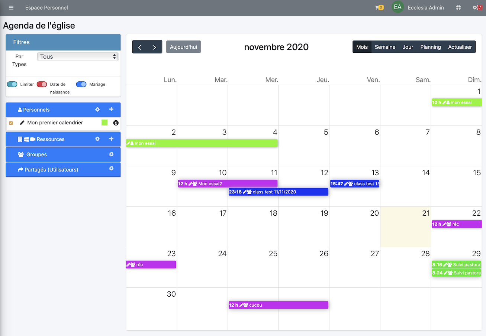
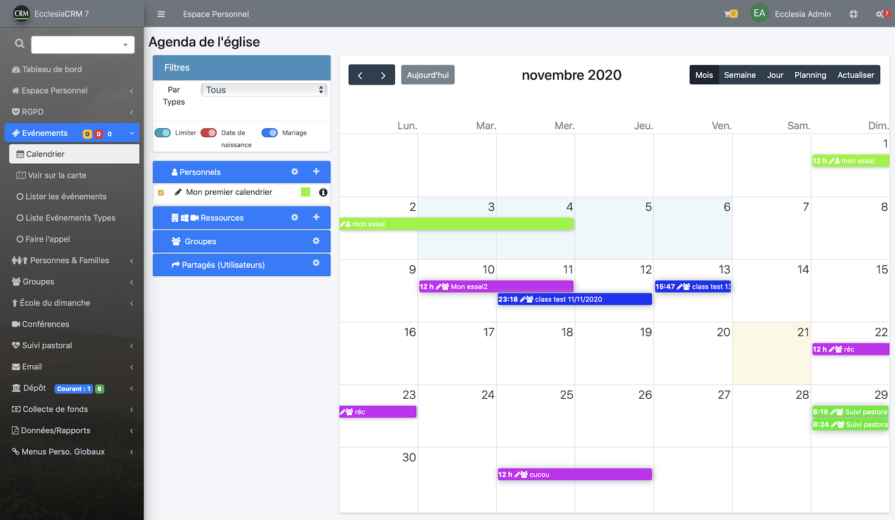
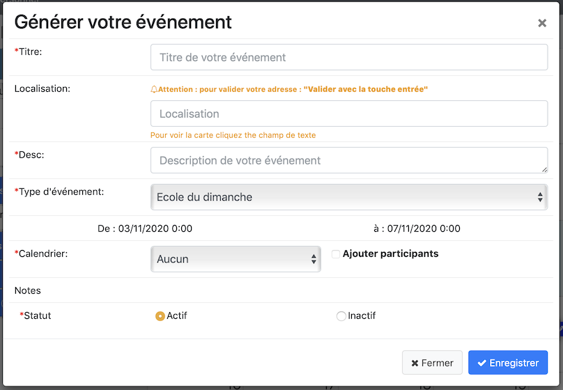
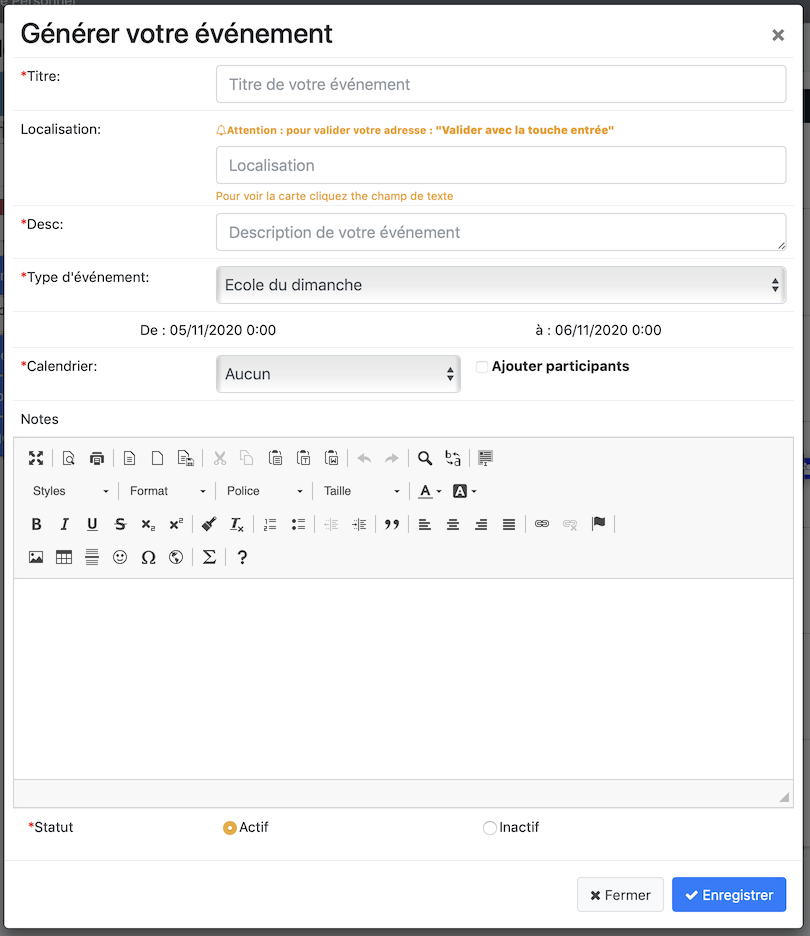

Il est possible de créer des événements de groupes, personnels et partagés.

## Création d'un événement

1. Aller dans la partie "Calendrier"

    

    - Il suffit de cliquer sur la zone de calendrier que vous voulez

       

    - Vous pourrez remplir l'événement comme suit

       

    - Ne pas oublier de choisir un calendrier
    - Il est possible de changer la date et rajouter une récurrence
    Pour cela cliquer simplement sur la date, la partie date se dépliera :

       

    - il ne vous reste plus qu'à personnaliser.
    - vous pourrez rajouter du texte à l'événement

       

2. Ou dans la partie "Lister les événements"

    

    - La démarche est ensuite la même que la partie ci-dessus.

3. Activer un document

    - il est possible de rendre un document actif ou inactif.

## Remarques

- Vous pourrez rajouter des participants aux événements.
- Il pourront ensuite être inclus pour faire un appel.
- en rendant l'événement inactif, il n'apparaitra pas dans le calendrier, seulement dans la liste d'événements. Il est donc possible de préparer des événements à l'avance et de les activer au cas par cas.

