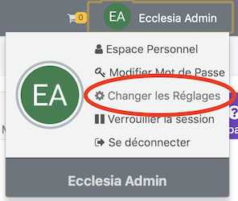
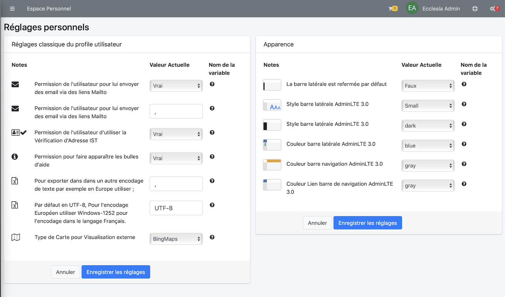

Un utilisateur a les droits suivants octroyés par l'administrateur

1. Pour modifier ses réglages personnels

	
	
2. Modifier les réglages ci-dessous

	
	
Note : selon votre administrateur, vous n'aurez pas forcément accès à tous ces réglages.

* bEmailMailto : Permission de l'utilisateur pour lui envoyer des email via des liens Mailto
* sMailtoDelimiter :	Permission de l'utilisateur pour lui envoyer des email via des liens Mailto
* bShowTooltip : Permission pour faire apparaître les bulles d'aide
* sCSVExportDelemiter : Pour exporter dans dans un autre encodage de texte par exemple en Europe utiliser ;
* sCSVExportCharset : Par défaut en UTF-8, Pour l'encodage Européen utiliser Windows-1252 pour l'encodage dans le langage Français.
* bSidebarExpandOnHover : La barre latérale se déploie par défaut au survol de la souris
* bSidebarCollapse : La barre latérale est refermée par défaut
* sMapExternalProvider : quand vous voulez visualiser l'adresse d'une personne sur une carte de votre Smartphone, vous pourrez choisir le type de carte à utiliser (Apple Maps, GoogleMaps, BingMaps). 
* sStyle : le style de thème que vous voulez mettre en place

Seront affectés par l'administrateur du CRM.

