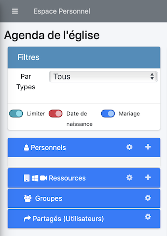
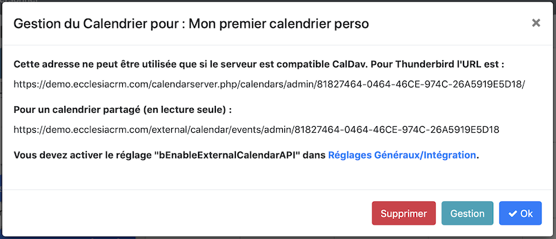
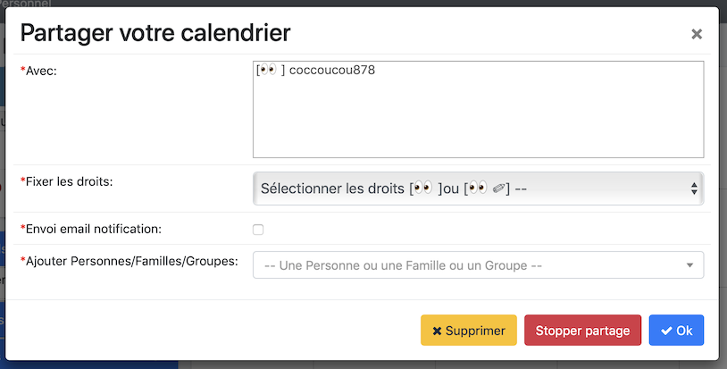

Un utilisateur peut créer des calendriers personnels les lire sur son smartphone ou à d'autres utilisateurs

## Partager un calendrier

1. Aller dans la partie gestion, c'est la deuxième roue crantée à côté du calendrier

   

2. Cliquer le bouton "Gestion"

   

4. Voici le résultat

   

5. Dans le champ texte, ajouter une personne une famille ou un groupe

6. Vous pourrez choisir les options Lecture/Ecriture

>Remarques
>- De même avec les calendriers groupes et partagés.
>- Un calendrier groupe ne peut être rajouté que par un admin.
