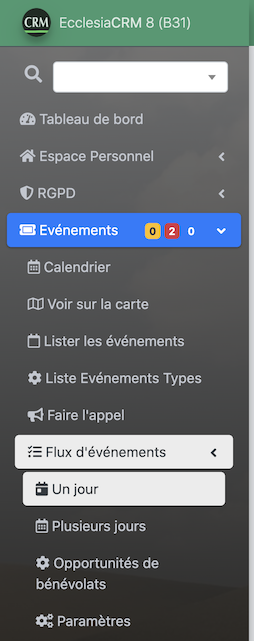
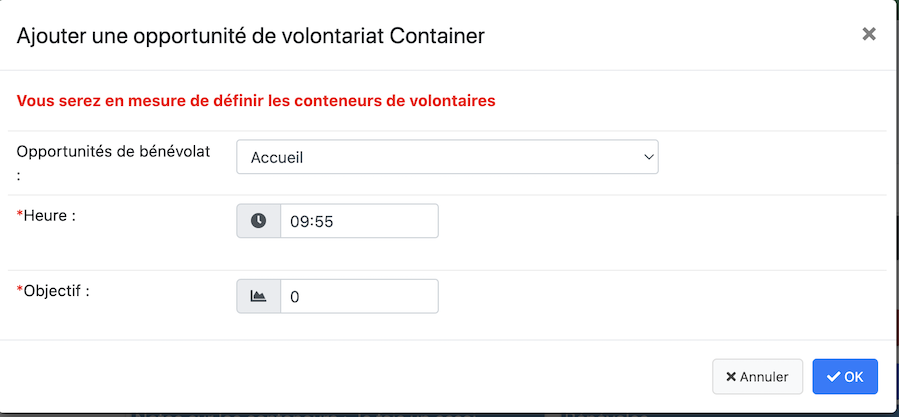
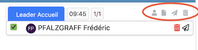
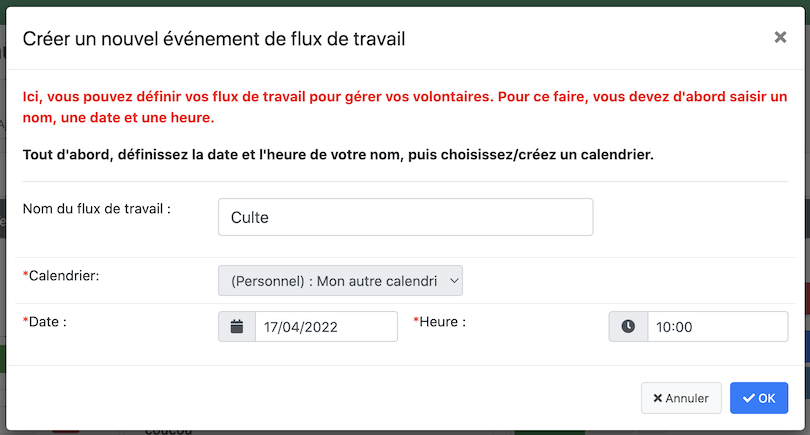

## Créer un flux d'événement (une journée)

- il vous permettra de créer un conteneur dans lequel vous pourrez
  - mettre, votre gestion complète d'un événement
  - de mettre les bénévoles
  - d'envoyer des mails pour les prévenir

- Pour créer un événement, aller dans le menu :

    

- Puis utiliser le bouton : "Créer un flux d'événement"

    

- On obtient la fenêtre suivante puis on pourra paramétrer la fenêtre suivante :

  

  C'est un flux de calendrier, on le retrouvera donc dans la vue calendrier. On doit y renseigner :

  - le nom du flux
  - le calendrier (ne pas oublier de le partager avec les autres personnes l'utilisant, voir pour cela l'aide sur les calendriers, dans le manuel utilisateur)
  - la date et l'heure ne pose pas de souci

Vous validez et l'événement est créé à la fois dans le  calendrier et dans la vue de gestion de flux d'événement.

## Mode constructeur : flux d'événement

### Actions

La barre d'outils suivante permettra de gérer complétement votre flux

#### Mode constructeur 

On clique sur ce bouton, si ce n'est déjà fait, par défaut il est actif.

Il vous permettra de construire complétement votre flux d'événement :
- titre
- conteneur
- sous conteneur en gérant vos opportunités de bénévolats.

Dans chaque flux d'événement, on peut créer un conteneur, il peut contenir :

##### On peut créer de base un titre

C'est un artifice permettant de simuler des titres

##### On peut alors créer une sous conteneur

On transforme ce titre en bloc de conteneurs d'opportunités de bénévolats.

Voici la vue obtenue

- On peut choisir les opportunités de bénévolats
- l'heure (c'est à titre indicatif entre entre deux sous conteneurs)
- l'objectif : le nombre de bénévoles qu'il faudra atteindre

##### On peut alors ajouter autant de sous conteneurs que l'on veut :

- des notes à gauche
- des sous conteneurs (les doodle à droite, on peut en mettre autant que l'on veut).
  Les doodles :
    - vous permettront de cocher les personnes

##### Action dans un sous conteneur

on peut rajouter

- des membres
- créer une note utile plus loin
- envoyer une mail
- Ou supprimer le sous contenur

#### Mode édition 

Vous pourrez rééditer l'événement

#### Envoi de mail 

L'envoi de mail, enverra un mail à toutes les bénévoles qui ont été cochés et ouvrira votre email personnel avec le résumé du flux.

#### Duplication du flux 

Cette partie permet de dupliquer le flux à l'identique (les bénévoles sont évidemment décochés)

#### Le dernier bouton permet de supprimer un flux

## Chronologie du flux d'événement (volontaires)

### Plan du culte pour les volontaires

## Chronologie du flux d'événement (volontaires)

### Plan du culte pour les volontaires

## Créer un flux d'événement (plusieurs jours)

Le principe est le même que pour un jour.

