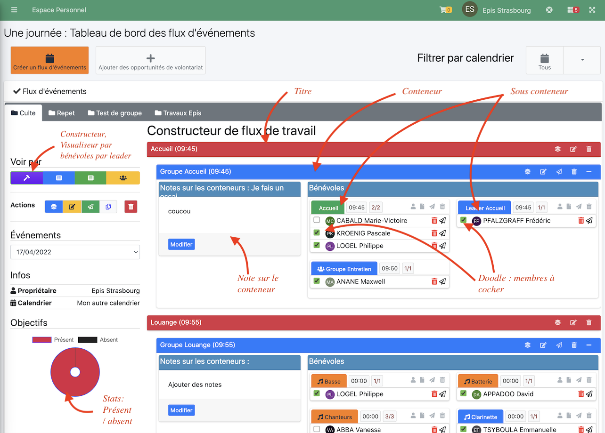

## Prérequis

- Le gestionnaire de flux d'événement est un plugin faisant partie de la version 8.0 d'Ecclesia**CRM**.
- il requiert un **calendrier** (personnel, de groupe, de matériel ou bien partagé), voir pour cela le manuel utilisateurs et la section calendrier.
- seul un utilisateur ayant les droits d'utiliser le plugin pourra l'utiliser.
- la notion de flux d'événements est bâtis sur les opportunités de bénévolats (exemple ci-dessous : Accueil, Leader etc ...)
Voir pour cela la rubrique associée : opportunités de bénévolats.

## Présentation

Le plugin "Flux d'événements" permet de gérer les plannings des bénévoles via un événement très particulier :

- pour le dimanche matin
- pour les répétitions

il y a deux types de flux d'événement :
- journalier
- sur plusieurs jours.

Il vous permettra de gérer vos membres via de mini doodle

- À gauche le graphique qui permettra de visualiser l'occupation du nombre de membres qui sont présents et absents
- à droite les membres à cocher
- il est possible de créer des titres en rouges, par exemple "Accueil (9h45)"
- des **conteneurs** : "Groupe Accueil"
  - Dans ce conteneur, des **sous conteneurs** (exemples : basses batterie) qui ne sont rien d'autre que de mini doodle (sous coneteneur), ou membre ou administrateur pourront cocher les présents ou absents
    - de gérer les objectifs à atteindre (1/2)
    - d'envoyer des emails au doodle
- il sera possible de dupliquer un flux pour pouvoir réutiliser le travail déjà produit d'un dimanche à l'autre.

## Envoi de mails

Il est possible d'envoyer un mail à tout membres :

- du flux d'événement
- de chaque conteneur
- de chaque sous conteneur (Doodle)
- de chaque membre

