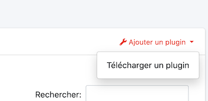
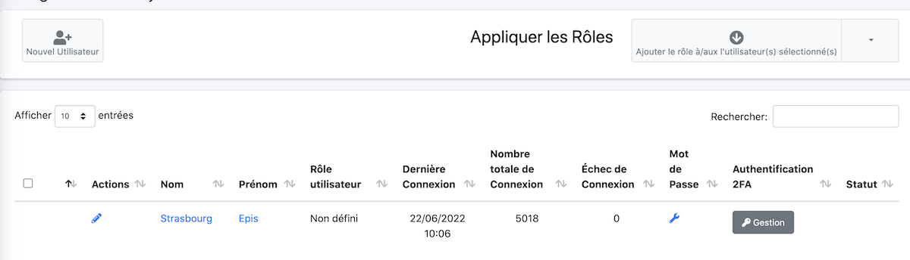

# Mise en place

Avec la nouvelle version 8.0 d'EcclesiaCRM, un nouveau volet dans la gestion administrateur est maintenant à votre disposition

Pour cela, il faut avoir des droits administrateurs

- aller dans la partie réglages en haut à droite

  

- Vous aurez ici la vue permettant de gérer les plugins

    

    Elle est assez similaire dans sa gestion à Wordpress.

- Il est possible d'ajouter un plugin

    

    **Attention** ce plugin doit être validé au niveau d'une signature numérique pour pouvoir être intégré à EcclesiaCRM.

- Il est possible d'activer ou de désactiver un plugin de manière groupée ou plugin par plugin.

    

- la mise à jour est en cours de développement et viendra dans une future version d'EcclesiaCRM.

# Gestion des droits utilisateurs

Tous les utilisateurs n'ont pas forcément droit d'accéder au plugin ou ne veulent pas y accéder.

Pour cela :
- Aller dans les réglages pour la partie utilisateurs

    

- On choisit un utilisateur
  

- On tombe sur la nouvelle gestion 8.0 d'EcclesiaCRM

  

    Il faut cliquer l'onglet à droite : "Permissions des plugins"

- On n'a plus qu'à activer ou attribuer les droits :

  

