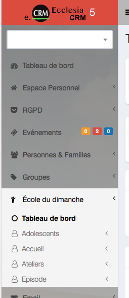
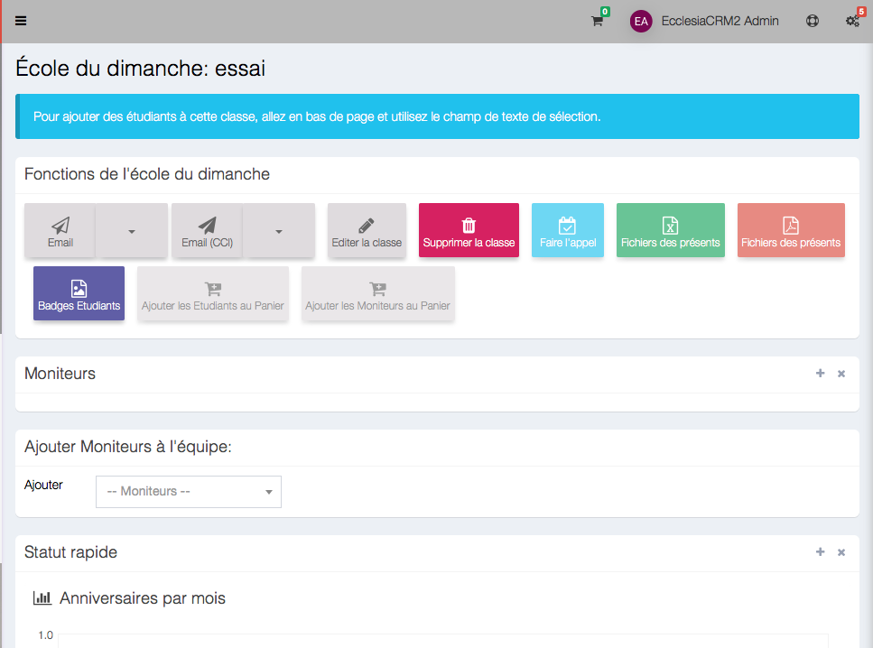
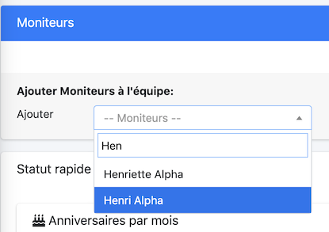
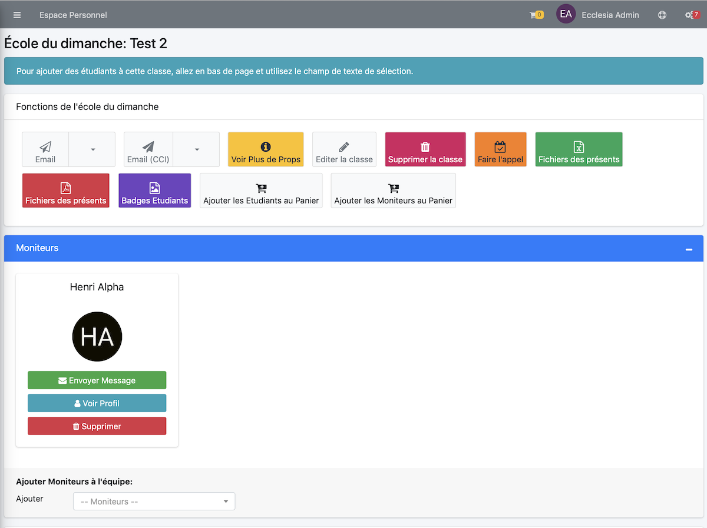
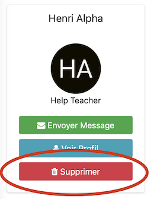
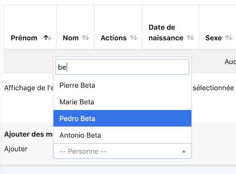
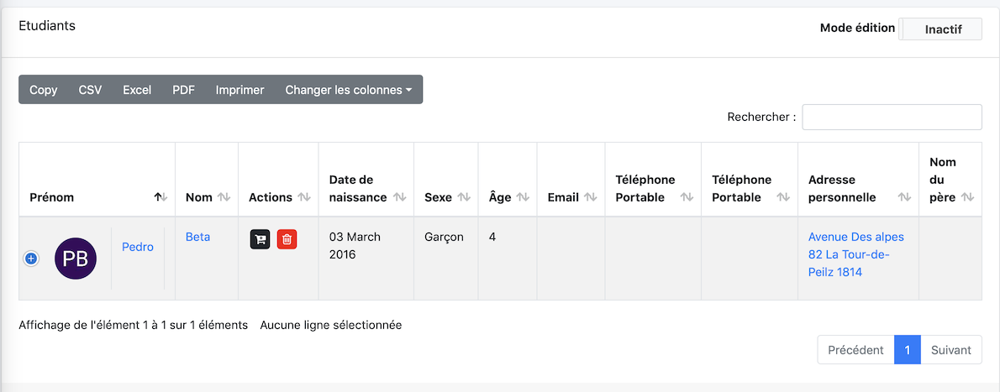
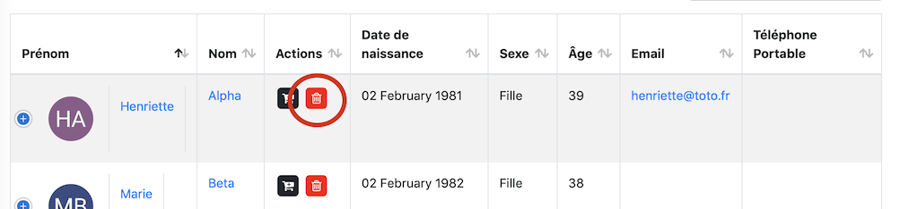
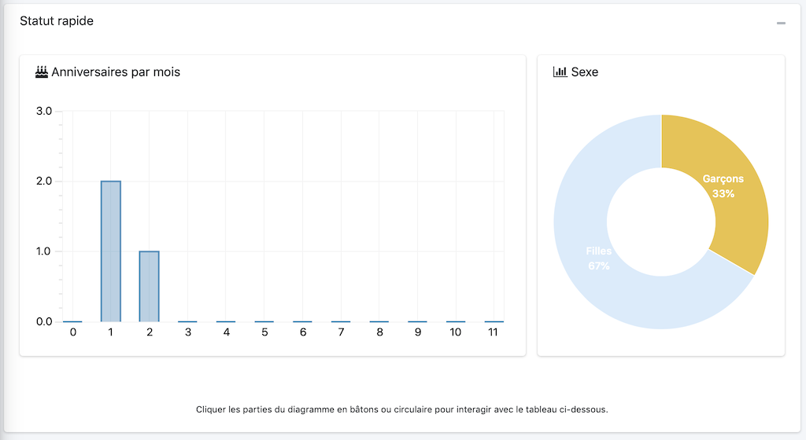

Dans une classe école du dimanche, vous pourrez
- ajouter des membres (étudiants ou moniteurs)
- faire des extractions CSV, Excell, créer des trombinoscopes
- faire des listes d'émargement
- faire l'appel et faire des extractions au niveau émargement
- etc ...

## Créer une classe

Pour cela aller dans le volet latéral : Barre de Menu -> Ecole du dimanche -> Tableau de bord

puis de mettre "bEnabledSundaySchool" sur vrai

Sair maintenant le nom du groupe

Vous serez directement redirigé vers la vue créé

## Ajouter des moniteurs

Pour cela, aller dans le menu

Puis saisi un nom

On valide, le moniteur apparait automatiquement dans la vue

## Supprimer un moniteur

La démarche est simple

## Ajouter d'enfants d'étudiants

Aller en bas de page

On fait de même que pour les moniteurs

On valide

> Note : Vous remarquerez qu'automatiquement on a des statistiques au dessus

## Suppression d'enfants d'étudiants

## Trie des étudiants par genre et par âge

Il suffit de cliquer sur les graphiques
- soit par mois
- soit par genre

Voici un exemple

Pour annuler le tri

## Extraire des données

Vous pourrez facilement extraire les membres de ce groupe via les boutons ci-dessous.

> Note : vous devez avoir les droits, via l'administrateur, de pouvoir de faire des extractions. Attention au RGPD. 