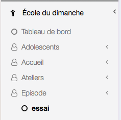
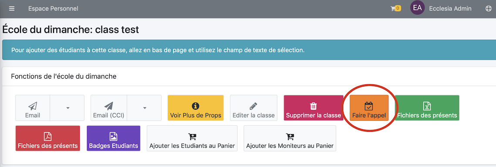
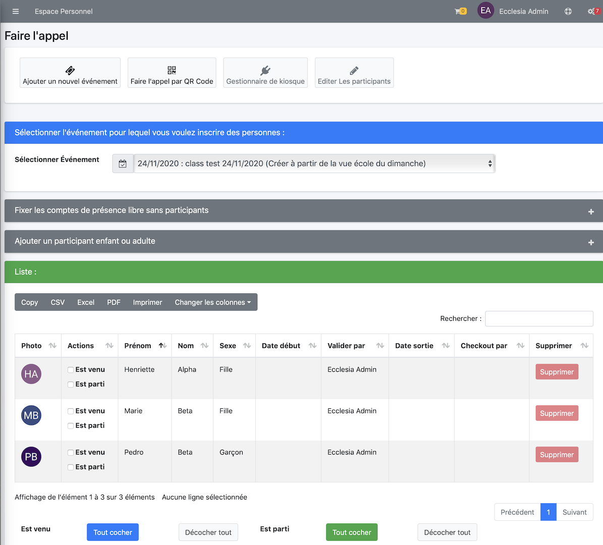
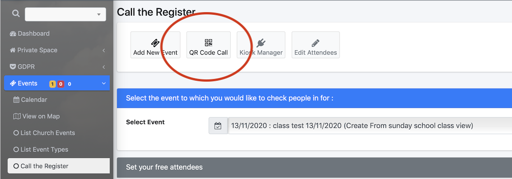
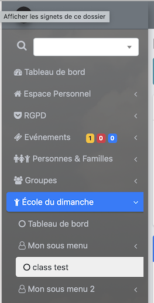
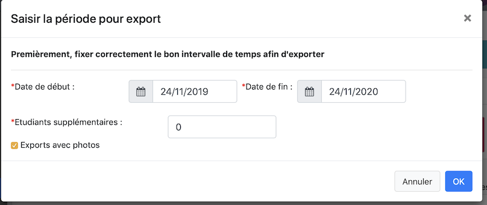

Vous pourrez faire l'appel pour une classe.

> Note : Tout utilisateur peut le faire l'appel du moment qu'il est moniteur dans cette classe.

## Faire l'appel

Il est possible de le faire de différente manière, la plus simple est

1. Choisir la classe

    

2. Puis activer

    

3. Il est maintenant possible de créer l'événement pour faire l'appel

    

4. On peut commencer à faire l'appel

    

5. Faire l'appel par QR code

    

    Vous obientiendrez cette fenêtre

    

    Si vous avez au préalable créé des badges avec QR code, vous pour valider les appels comme suit

    

    Et ... c'est fait

    

Pour terminer
* cliquer tout cocher ou tout décocher

    

* puis cocher dans la liste les présents
* en bas de page

     

> **Note** : il est toujours possible de laisser dans la partie texte quelques notes.
> Vous pourrez glisser déposer des images et des fichiers pour agrémenter l'outil.

## Exporter la classe au format CSV ou PDF

Choisir la classe

Vous obtiendrez cette vue

Cliquez sur un ou l'autre bouton.

Vous obtiendrez l'historique réelle des appels sur plusieurs mois, en sélectionnant la période ...

> Note : L'export se fera naturellement avec les statistiques de présence ....
