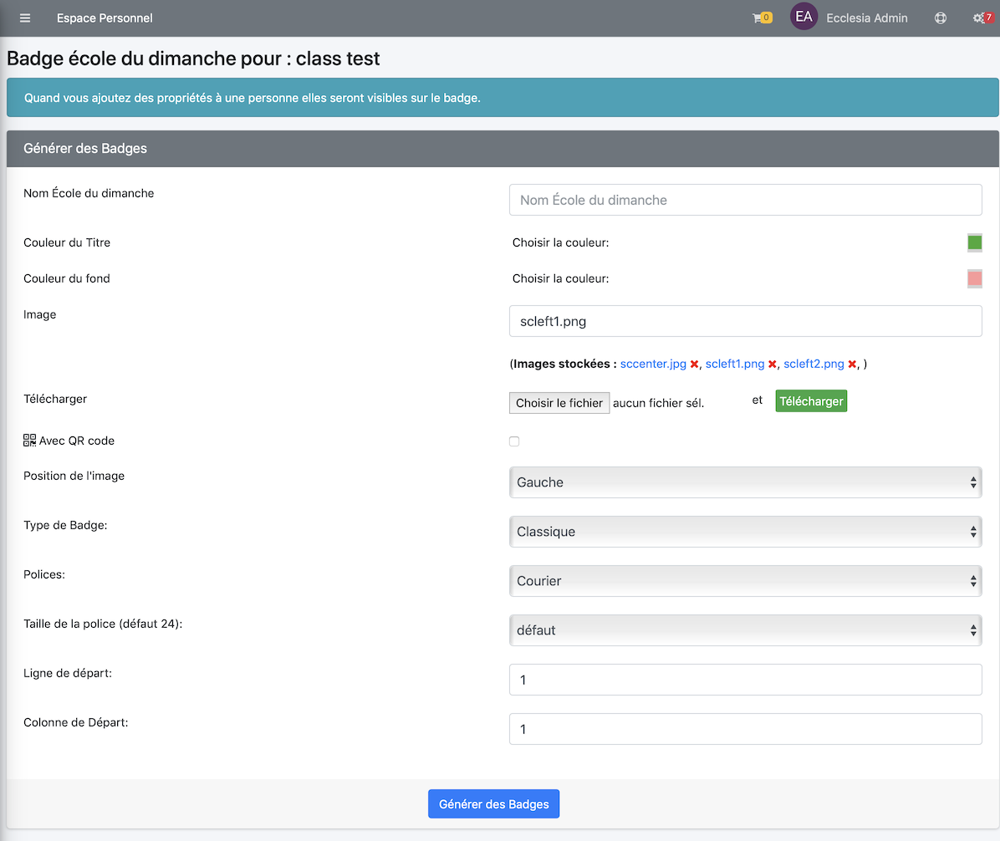
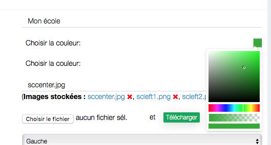
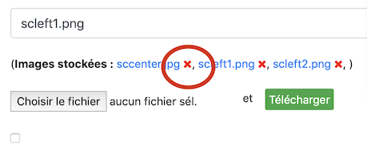
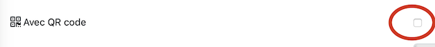

> Note : cela est possible que si l'administrateur vous donne l'autorisation de pouvoir le faire, au niveau export PDF et CSV

Vous pourrez ici créer des badges avec

- une couleur de fond
- avec une image en fond
- une image en bordure
- un QR code (utile pour faire un appel par QR code)

## Créer des badges

Aller dans un groupe école du dimanche

Cliquer le bouton : "Badges Etudiants"

La vue obtenue

Choisir parmi les options

- Le nom de l'école du dimanche
- la couleur de titre et du fond

    

- Choisir une image de fond et la mettre
    * à gauche
    * à droite
    * en la centrant, il est possible de recouvrir toute la largeur

- Pour sélectionner une image de fond, cliquer son titre

    

- Pour la supprimer, cliquer la croix rouge

    

- Type de Badge (étiquette standard), attention de bien régler son imprimante sans bordure.

    

- La colonne de départ et la ligne de départ est utile pour gérer les feuilles d'étiquettes autocollantes déjà entamées.

- il est possible également de créer des badges avec des QR codes

    

** Puis cliquer le bouton "Générer des Badges".**

Voici le résultat, l'image est à gauche, mais on peut la mettre comme bon nous semble

Et avec des QR-code

> **Note** : ne pas oublier, quand vous imprimez, de choisir d'imprimer sans bordure. 
> vous pourrez rajouter le fait qu'un enfant est allergique ou qu'il ne veut pas de photos.

