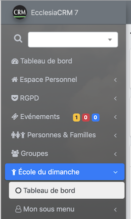
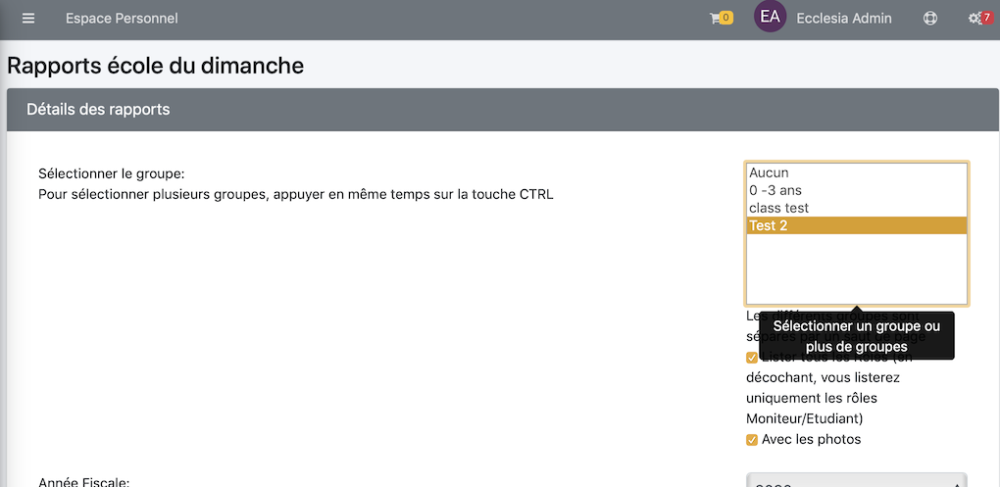
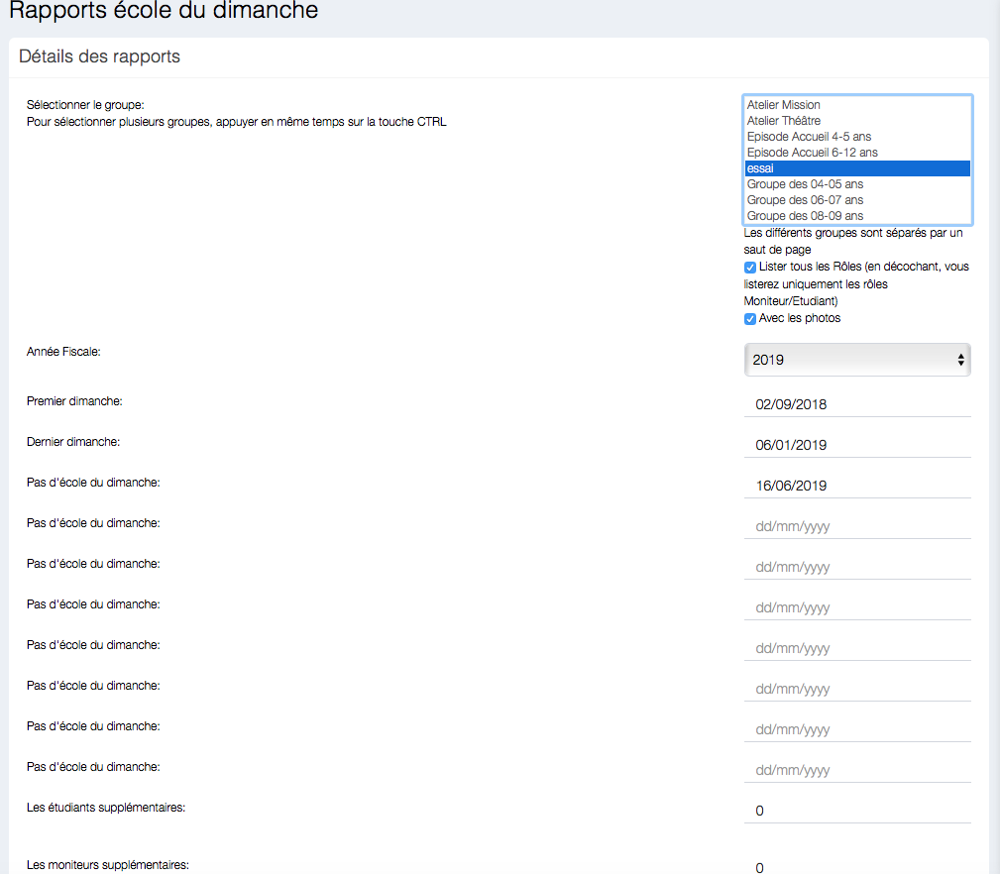

Vous pourrez créer
- des trombinoscopes
- des listes de présences
- des listes de classe

> Note : cela est possible que si l'administrateur vous donne l'autorisation de pouvoir le faire, au niveau export PDF et CSV

## Pour créer ces extractions

Aller dans le menu "Ecole du dimanche" -> "Tableau de bord" 

Choisir ensuite

Puis choisir une classe ou plusieurs classes

## Pour un trombinoscope

Cliquer le bouton rouge : "Trombinoscope"

Le trombinoscope vous fournira les moniteurs et les étudiants

## Pour la liste des classes

Il faut cliquer le bouton ad'hoc

> **Note** : elle fournira la liste des élèves à distribuer aux moniteurs, elle contiendra éventuellement les allergies pour les étudiants, ou le fait, qu'ils ne désirent pas être photographié.

## Pour les feuilles de présence

Il y a deux types différents

- La feuille de présence (qui est définie en fonction des exceptions de date au dessus), elle permet de faire un émargement à la main, elle ne tient pas compte des enregistrements dans la base de données.
- La feuille de présence réel, elle est fonction des appels fait durant l'année ou la portée au niveau des dates et permet de faire une extraction. Voir pour cela la section : "Faire l'appel".

> **Note** : vous pourrez rajouter le fait qu'un enfant est allergique ou qu'il ne veut pas de photos.