Il est possible de classer les groupes école du dimanche dans la barre latérale.

> Note : On aimerait pouvoir différencier moniteur des aides moniteurs

## Créer une propriété spécifique d'école du dimanche : "Aide"

> Un groupe école du dimanche est simplement un groupe.
> L'idée est la même que pour rajouter une propriété spécifique au groupe.

Nous allons dans la classe concernée et allons l'éditer

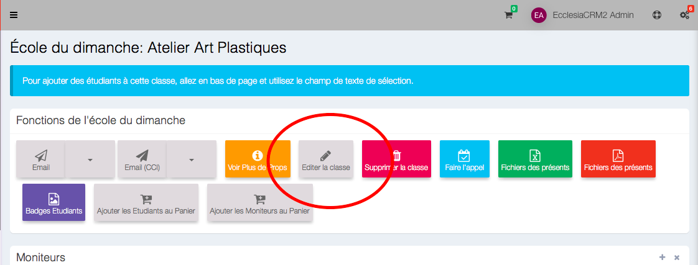

On active les propriétés

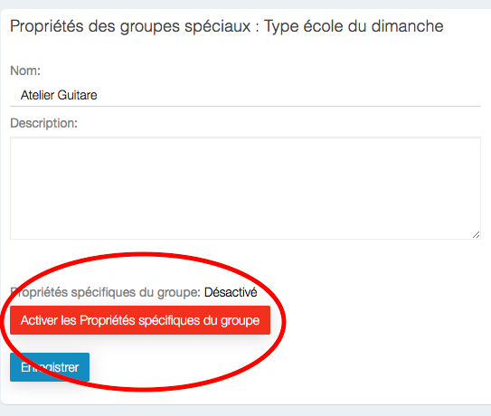

On peut maintenant en ajouter

On va créer la propriété aide

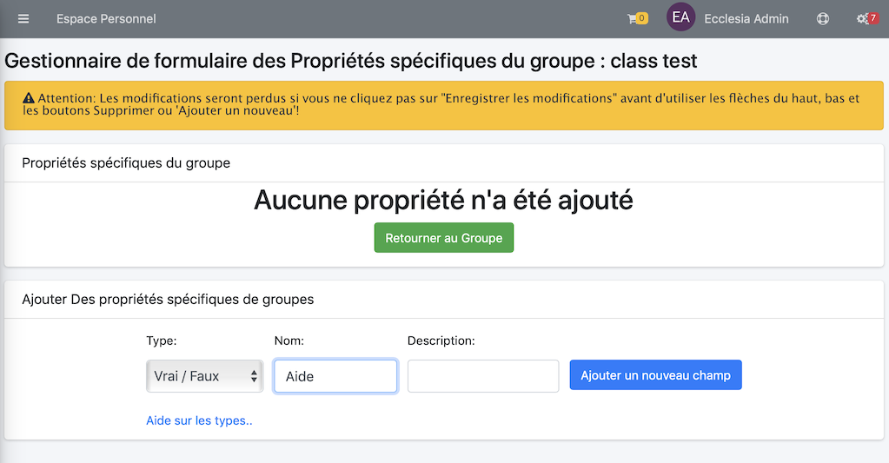

On la valide par le bouton : "Ajouter un nouveau champ"

IMPORTANT : On peut maintenant cocher la case "visualiser dans Profil de la Personne"

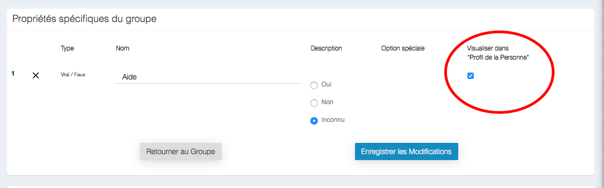

> Note : les propriétés spécifiques de groupe sont de deux natures  
• globale (pour qu'un manager de groupe puisse faire passer des informations au groupe). 
• par utilisateur (elles permettent de faire des statistiques), 
ou dans notre cas de **faire des "aide" mono**.

## Ajouter la propriété à un moniteur

On va dans le groupe école du dimanche où se trouve le moniteur.

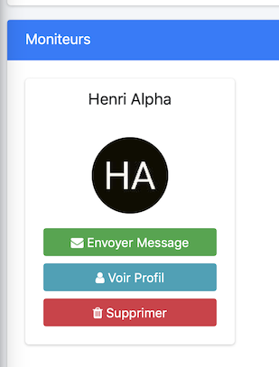

On sélectionne le profil 

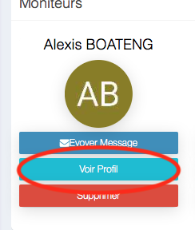

On va dans la partie groupe

Et on modifie les propriétés 

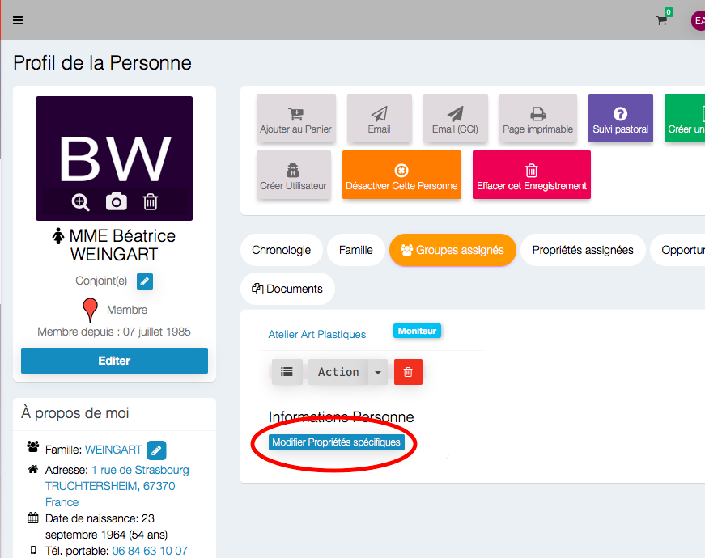

On obtient cette vue

On valide à oui 

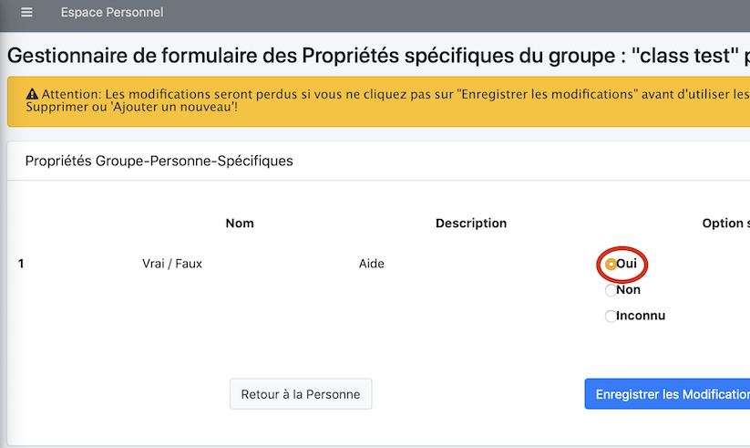

**et on enregistre les modifications **

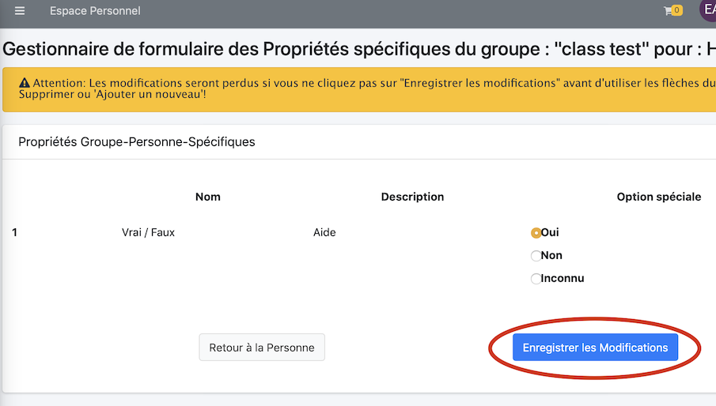

On retourne pour visualiser le résultat sur la personne

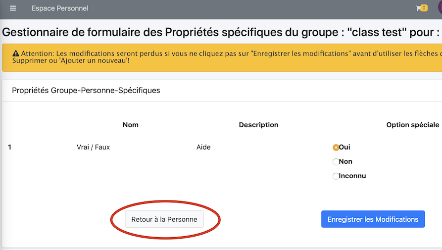

Vous devriez avoir ce résultat sur la personne

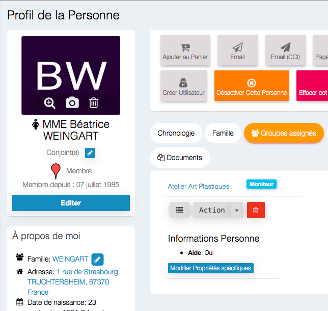

## Au final

Nous avons un aide mono

## Dans le cas des exports

Voici le résultat au niveau export

- Trombinoscope

- La liste des mono et étudiants

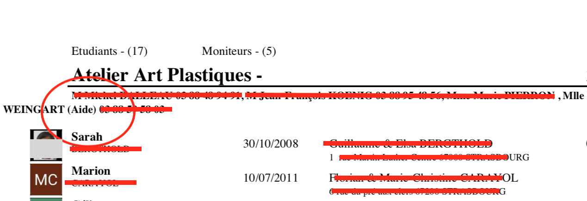

