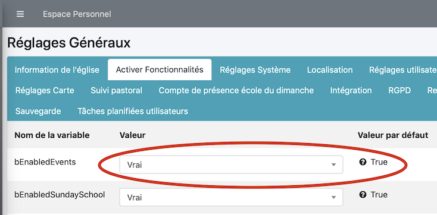

La gestion de l'école du dimanche est pleinement fonctionnelle.

## Activer la fonctionnalité : école du dimanche

Pour cela il faut aller dans les "Réglages systèmes" -> "Modifier les réglages généraux" -> "Activer les fonctionnalités"

puis de mettre "bEnabledSundaySchool" sur vrai

	

## Fonctionnalités

Voici en résumé les possibilités du d'EcclesiaCRM dans ce domaine

- Par défaut un moniteur peut faire un appel (créer un événement de groupe ecole du dimanche sur le groupe).
- Il est possible de faire des exports CSV
- On peut ici créer des listes de présent (dynamiquement selon l'appel fait) ou de créer des grilles présence.
- Il est possible de faire des tries par mois de naissance, par genre, c'est une facilité pour gérer les anniversaires.
- Il est également possible de créer des badges
- des trombinoscopes.
- rajouter dans tout cela des propriétés sur des utilisateurs (est allergique à ...) et de pouvoir créer des listes personnalisés.
- etc ...
