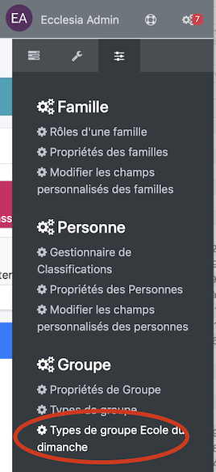
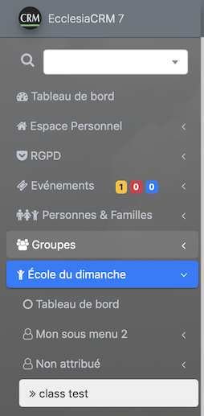
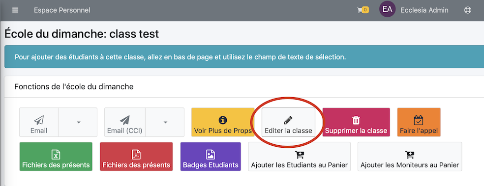
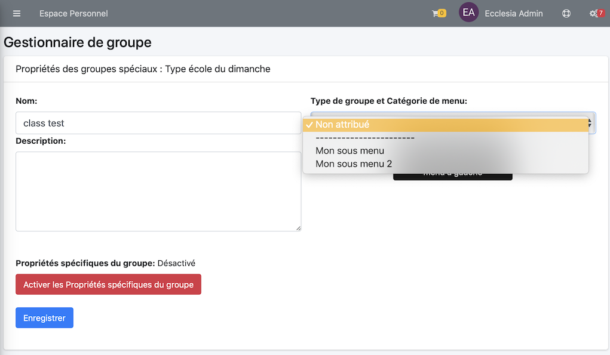
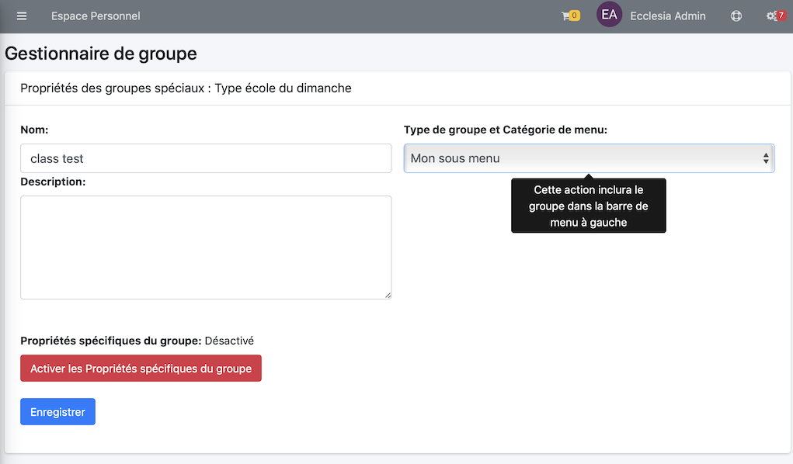

Il est possible de classer les groupes école du dimanche dans la barre latérale.

> Note : cela est possible que si l'administrateur vous donne l'autorisation de pouvoir le faire.

## Gérer les classements

Pour cela aller dans le volet latéral de droite pour accéder aux réglages

Vous accéder à la vue de création de sous menu et de classement

Vous pourrez les classer facilement via les flèches allant en haut en bas.

## Affectation d'une classe à un de ces sous menus

Pour cela aller dans la classe créée et non attribuée, pour cela, aller dans le volet latéral gauche et sélectionner la classe : "essai"

Puis Editer la classe

Vous pourrez choisir le sous-menu, ici

Sélectionner ensuite

Et voici le résultat

> Note : cela permet de trier facilement ses groupes dans la partie école du dimanche !

