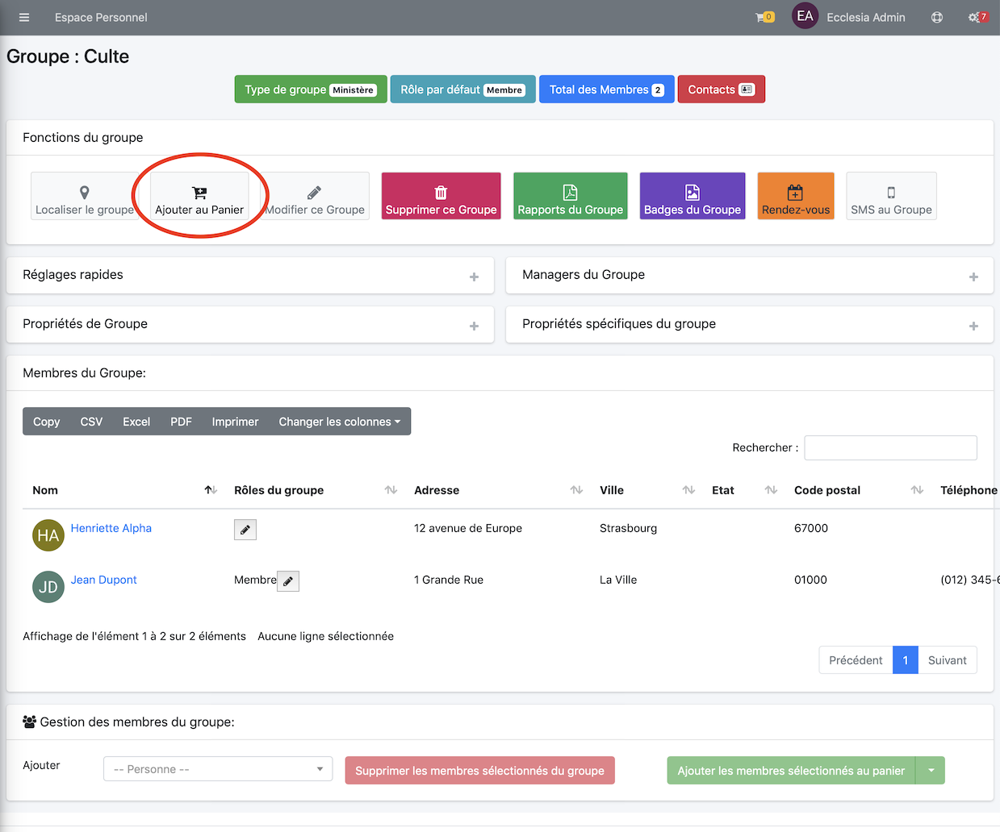
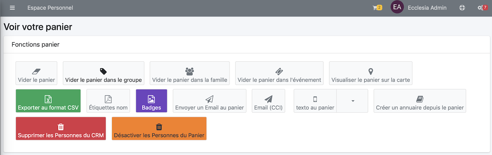

# 
<big>Email & Ecclesia**CRM** </big>

Pour envoyer des mails via Ecclesia**CRM**

Avant de vouloir envoyer des mails via Ecclesia**CRM** la configuration Email doit être activée. Voir pour cela la page de configuration Email dans le manuel administrateur.

##Pour envoyer des emails via votre client Email sur PC ou Mac ou sur tout autre Client sur Smartphone

1. il suffit pour cela d'ajouter les Membres d'un groupe ou via un profile au Panier 
 
Voici le résultat 

2. Puis aller "Panier → Afficher Le panier". 

3. Cliquer "Envoyer un Email au Panier". 

4. Les emails seront envoyés via votre client sur PC ou Mac ou autre ....

##Email via Mailchimp

Voir pour cela le manuel Email->MailChimp 

