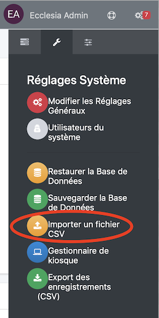
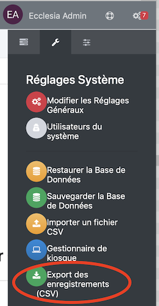
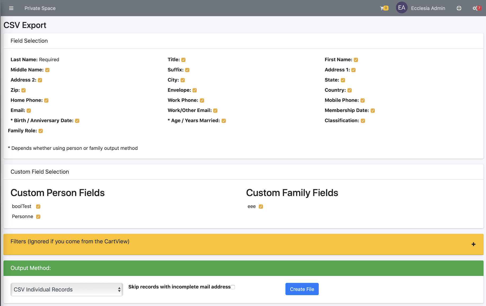
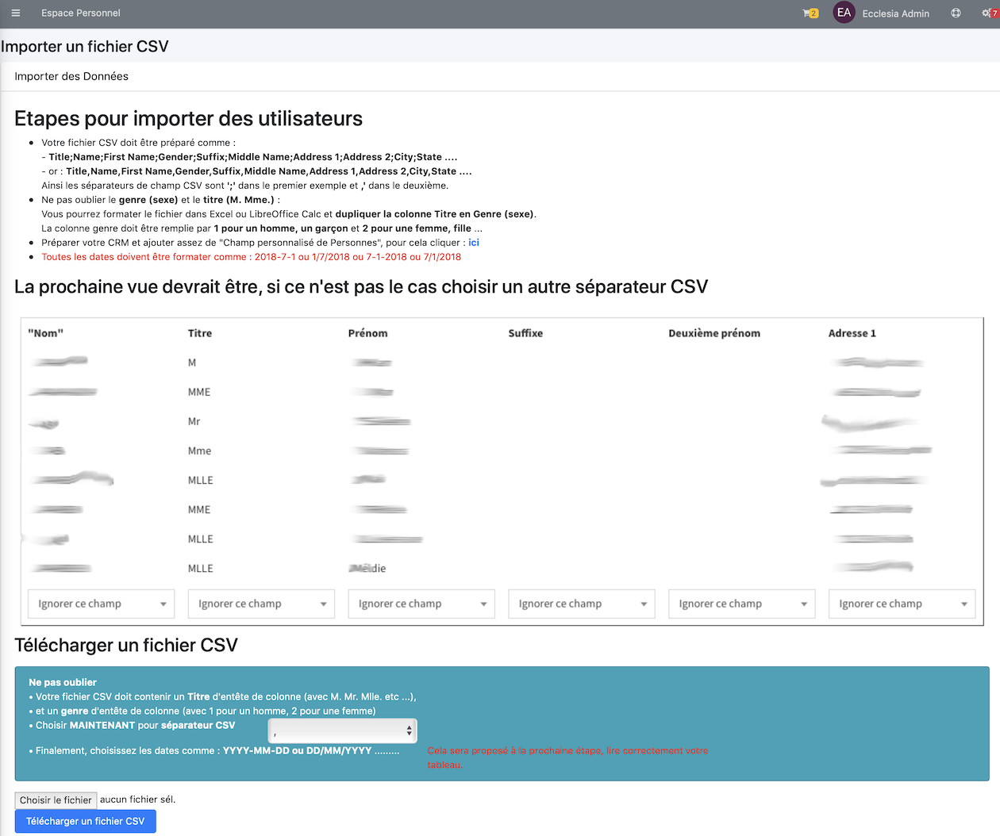
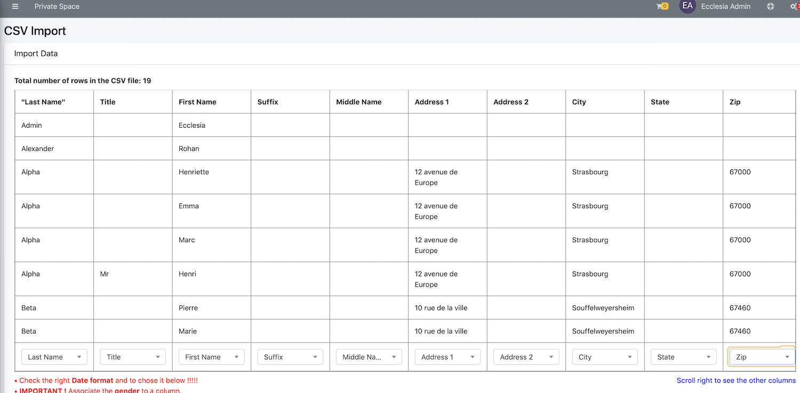
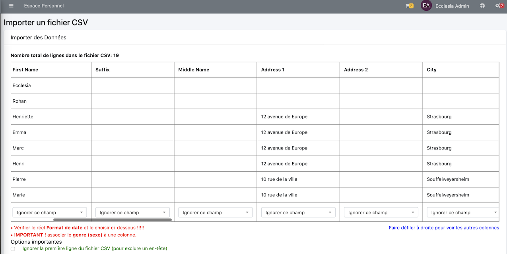

# 
<big>Import de données & Ecclesia**CRM** </big>

## Supprimer toutes les personnes et familles du CRM

1. Pour cela ouvrir l'outil d'importation de fichier CSV

    

2. Cliquer le bouton "Effacer les personnes et les familles"

    

3. Vous devrez confirmer par : "J'ai compris"

    

## Export de toutes vos familles et personnes

1. Ouvrir "Export des enregistrements CSV"

    

2. Cocher toutes les cases des zones "Sélection de champs" et "Sélection de champ personnalisé"

    

3. Puis cliquer "Créer un fichier"

##Avant d'importer un fichier CSV

Si vous voulez passer de ChurchCRM à EcclesiaCRM

- dans un premier temps exporter toutes vos familles et personnes avec la méthode vue au dessus.
- Ensuite il faudra créer tous les champs personnalisés de personne dans EcclesiaCRM à l'identique de votre ancienne version de ChurchCRM :
    "Manuel : Administrateur" -> "Gestion des personnes" -> "Personnalisation" -> "Champs personnalisables"
- il faudra qu'ils aient exactement le même nom à la lettre (attention aux majuscules et minuscules).

##Classification des membres

Il est possible d'importer le personnes selon le fait qu'ils soient membres, invité etc ...

Note: A la fin de l'importation, tous les membres sont automatiquement dans le "Panier", vous pourrez créer un groupe directement.

Vous pourrez importer des données via un fichier CSV avec le séparateur "," ou ";". Chaque ligne du fichier doit contenir les informations pour une personne.

La fonctionnalité "Importer un fichier CSV" se trouve dans le menu administrateur

> Notes : Here one will find the manuel to import the data file automatically;
>
>Vous trouverez ici vous permettant de manière guidée d'importer les données de manière automatisée. Si vous sélectionnez le genre correctement vous permettra de créer automatiquement les familles selon les adresses.

 Voici le informations de base

 - Titre (pour la création de famille)
 - Prénom
 - deuxième prénom
 - Le nom
 - le suffixe
 - le genre
 - Enveloppe de don
 - Adresse1
 - Adresse2
 - Ville
 - Etat
 - Code postal
 - Pays
 - Le téléphone personnel
 - Le téléphone professionel
 - Le téléphone portable
 - email
 - Travail/Autre téléphone
 - la date de naissance
 - La date d'adhésion à l'église
 - La date de mariage
 - des champs personnels pour la personne
 - des champs personnels pour la famille

Les dates peuvent être formatées sous la forme YYYY-MM-DD, MM-DD-YYYY, or DD-MM-YYYY. Les séparateurs de date (un tiret, un slash, etc.) ou le blanc ne peut fonctionner.

Laissez-vous guider par l'outil et la documentation intégrée à l'outil.

##Import a CSV file

Maintenant vous êtes prêt pour importer votre fichier

1. On passe par le menu classiquement

    

    Le bouton "Télécharger un fichier CSV" est un rôle administrateur.

2. Il faut lire très attentivement les instructions de la vue suivante

    

    Puis cliquer "Télécharger un fichier CSV"

3. Vous devriez obtenir le tableau suivant

    

    > Note : si le résultat n'est pas un tableau, il faut retourner en arrière et choisir un autre séparateur CSV "," to ";"
      Ensuite il faudra mettre en relation les noms des colonnes en haut avec le champ d'importation plus bas.

4. Ensuite glisser de gauche à droite votre tableau pour traiter tous les champs

    

5. Si votre fichier CSV a des descripteurs

    

6. Terminer en sélectionnant le type de famille etc ...

    

7. Vous devrier au final avoir

    

Bien entendu, il faudra affecter vos personnes
- dans vos groupes
- dans vos groupes école du dimanche
- etc ...

Note: A la fin de l'importation, tous les membres sont automatiquement dans le "Panier", vous pourrez créer un groupe directement.

##Créer des enregistrements de familles

EcclesiaCRM peut créer pour vous directement des familles. Encore une fois laissez-vous diriger par l'outil. L'outil est bati sur le fait

- Qu'elle partage la même adresse
- Elle partage des données qui font partie de champ personnels de familles.

Pour cela sélectionner le mode de génération de famille.

