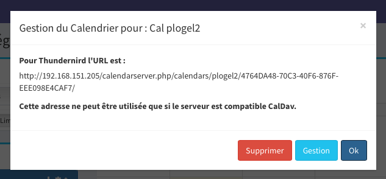

Un utilisateur peut créer des calendriers personnels les lire sur son smartphone ou à d'autres utilisateurs

## Calendriers

   Pour y accéder, aller dans la barre latérale et choisir Evénements et calendrier

  
  
Il y a trois type de calendrier :
    - les personnels.
    - les groupes.
    - les partagés.

## Pour ajouter un nouveau calendrier
- Cliquez sur le "+"
    
       
       
- Il suffit de choisir un nom
  
## Modifier sa couleur

- On clique sur l'icône du calendrier

       

- Vous choisissez la couleur voulue

       
       
- le résultat est immédiat à droite.

## Inclure/exclure ses calendriers

1. Vous pourrez inclure ou exclure des calendriers :

    -  Pour cela cliquez sur la roue crantée
    
       
       
    - Sélectionnez le calendrier à inclure/exclure
    
       
       
    - Vous obtiendrez
    
       
       
    - Dans la barre latérale le calendrier est masqué et non supprimé
    
       
       
## Pour supprimer un calendrier

1. Aller dans la partie gestion, c'est la deuxième roue crantée
       
       
       
2. Cliquer sur supprimer
    
       

