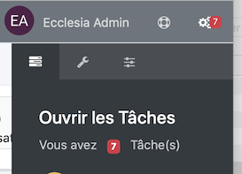
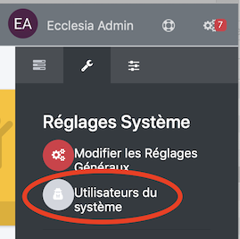
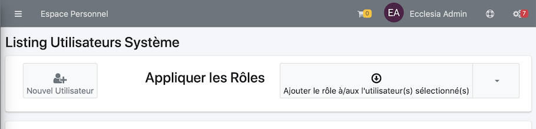
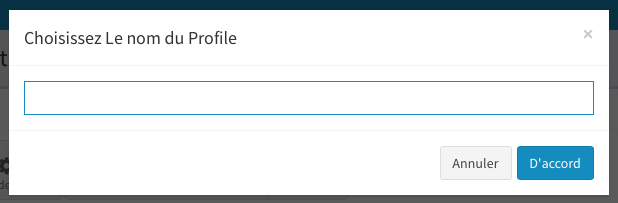
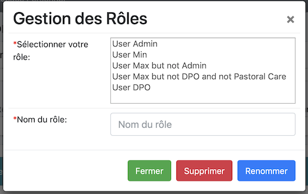

## Introduction

** ATTENTION ** pour créer un rôle utilisateur, il faut qu'un utilisateur autre que l'utilisateur Administrateur soit créé.
	Deux rôles par défaut sont installés

## Gestion des rôles

1. Pour accéder à la gestion des rôles
	* Aller dans les réglages

		

	* Puis Aller dans la partie "Utilisateurs du système"

		

	* On peut maintenant gérer les utilisateurs ou en créer

		

2.  Pour en modifier un, il suffit dans la ligne référante à un utilisateur de cliquer sur l'icône stylo

	

## Affecter un rôle à l'utilisateur courant

Aller dans la partie "Utilisateurs du système", sélectionner un utilisateur.

1. Une fois les étapes ci-dessus traitées, vous obtiendrez

	

2. Vous pourrez utiliser un rôle par défaut

	

3. Les cases à cocher en dessous seront cochées

	

4. Enregistrer ensuite vos réglages.

## Créer des rôles

Aller dans la partie "Utilisateurs du système", sélectionner un utilisateur.

1. Cocher toutes les cases que vous voudrez pour l'utilisateur sélectionnée

2. Cliquer sur le bouton suivant

	

3. Adjoindre un nom

	

## Modifier le nom ou supprimer un rôle

Aller dans la partie "Utilisateurs du système", sélectionner un utilisateur.

1. Sélectionner le bouton suivant

	

2. Se Laisser guider.

	

